# AnyBrand - 完全サイト構造マップ

TikTok Shop Affiliateプラットフォーム「AnyBrand」の完全なサイト構造ドキュメント。
このファイルを見れば、全ページ構造・遷移先・UI要素・認証フロー・データ構造が完全に理解できる。

---

## スクリーンショット

### 公開ページ

| # | ページ | スクリーンショット |
|---|--------|-------------------|
| 01 | ランディング | 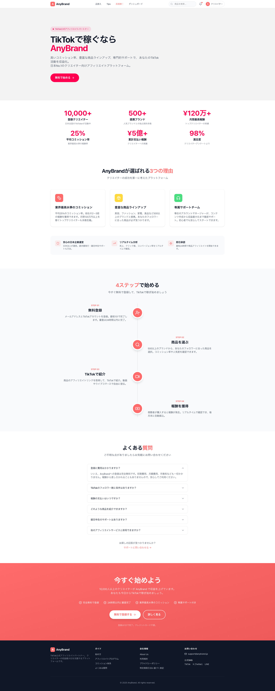 |
| 02 | ログイン |  |
| 03 | 新規登録 | 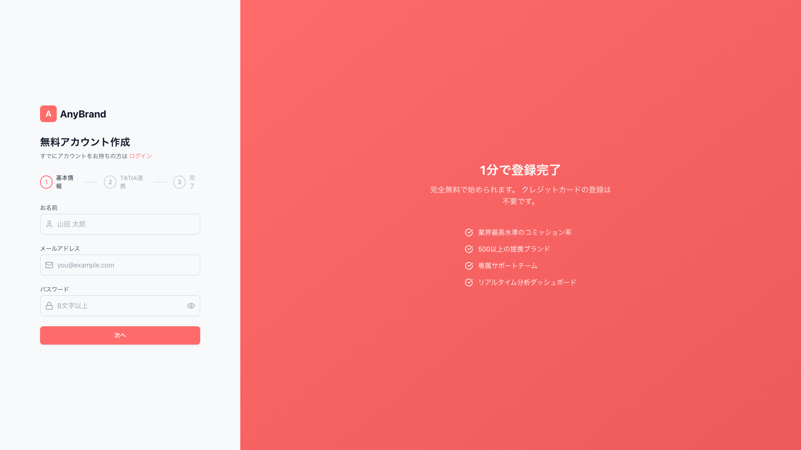 |
| 04 | 利用規約 | 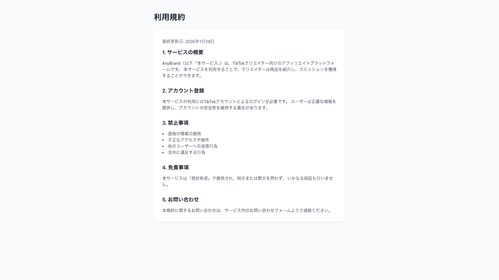 |
| 05 | プライバシー |  |

### 認証後ページ

| # | ページ | スクリーンショット |
|---|--------|-------------------|
| 06 | ダッシュボード |  |
| 07 | 商品カタログ | 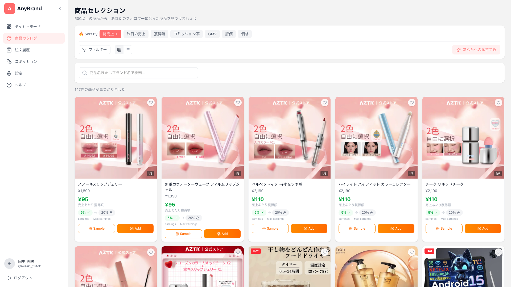 |
| 08 | 商品詳細 | 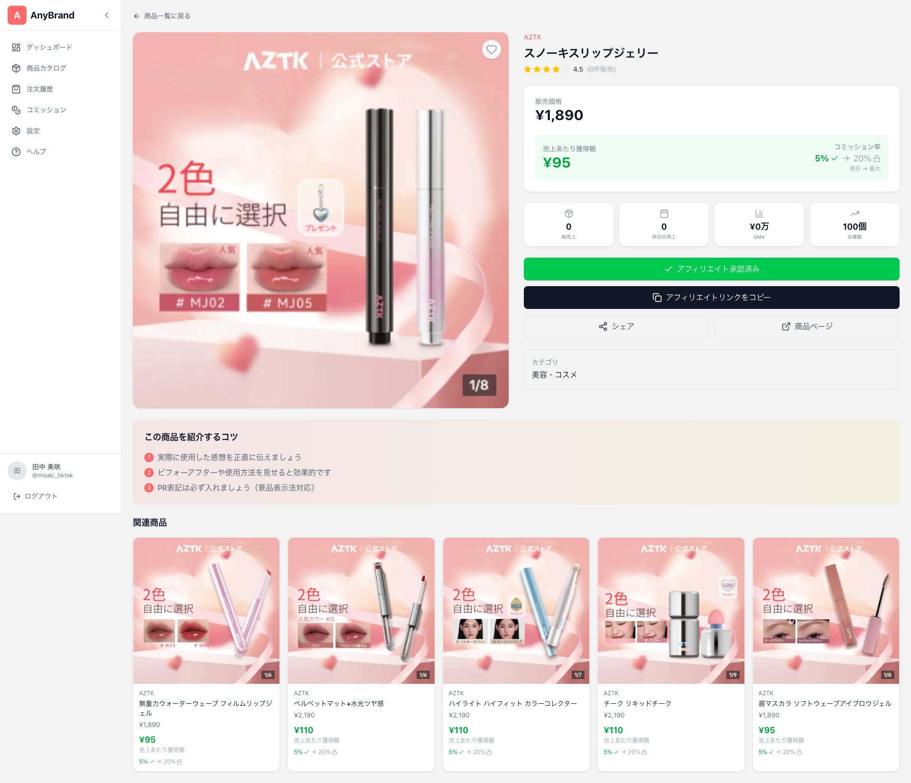 |
| 09 | 注文履歴 | 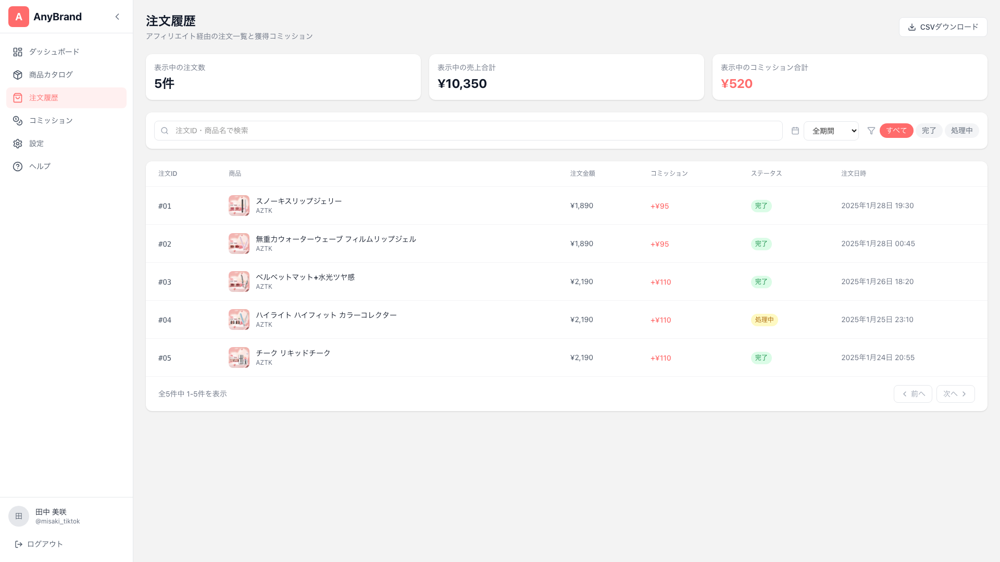 |
| 10 | コミッション | 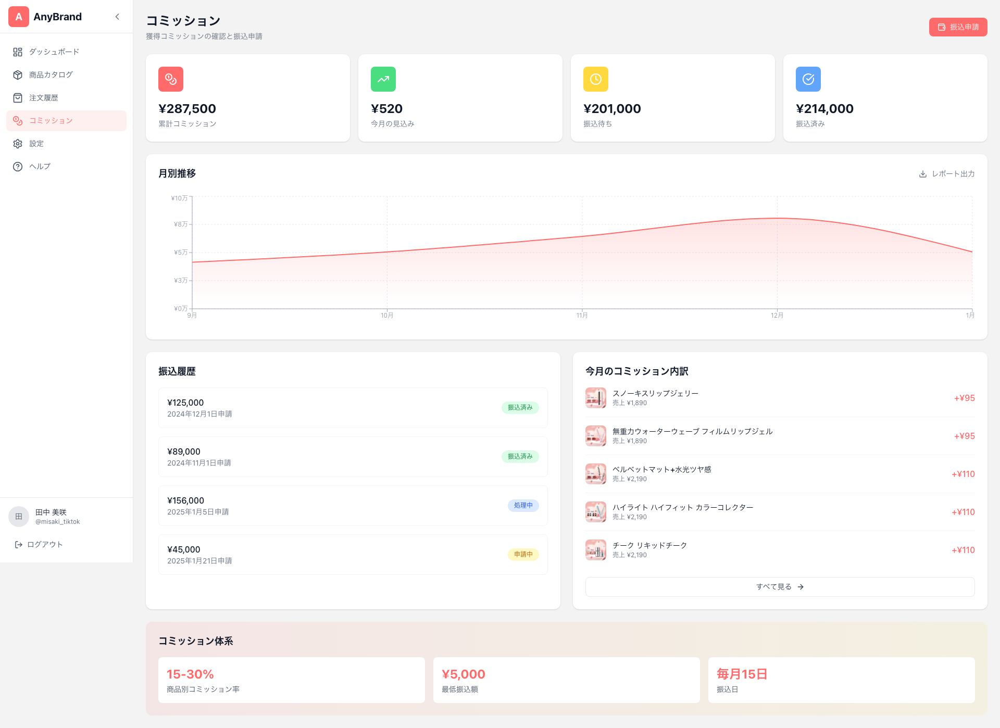 |
| 11 | プロフィール | 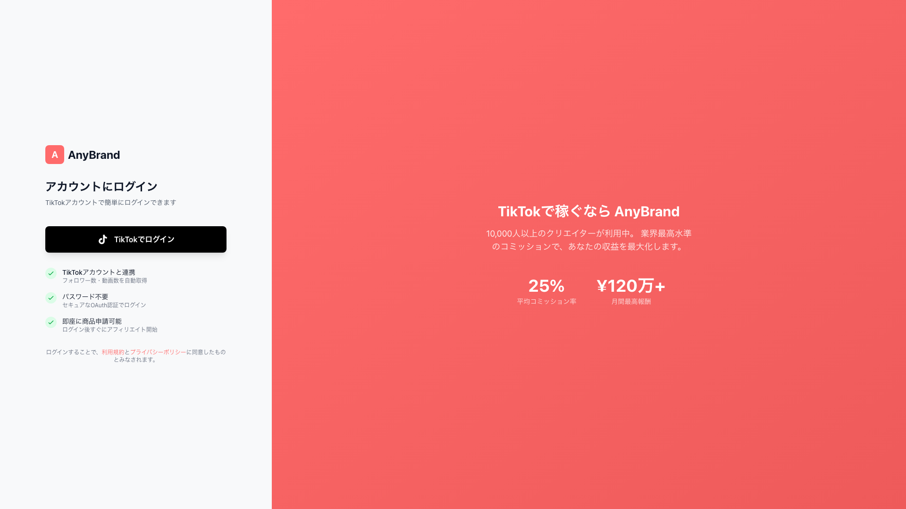 |
| 12 | 設定 | 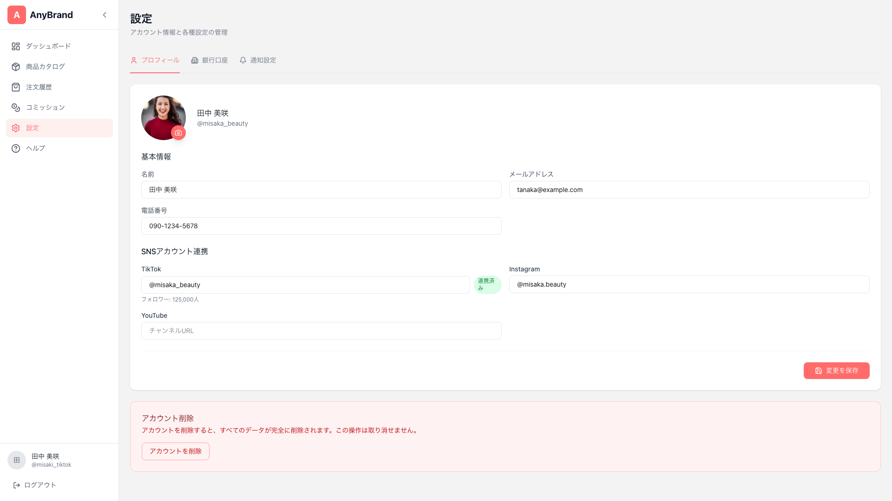 |
| 13 | ガイド |  |

### モーダル

| # | モーダル | スクリーンショット |
|---|---------|-------------------|
| 14 | Add Affiliate | 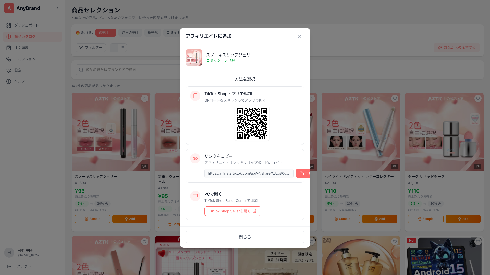 |
| 15 | Get Sample |  |
| 16 | Request Payout | 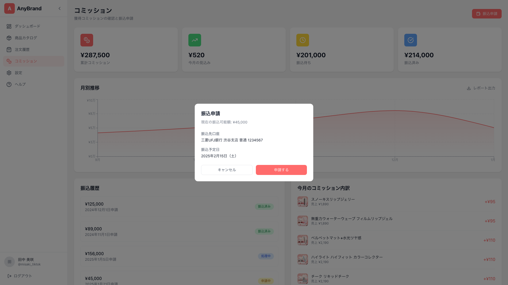 |

---

## 目次

1. [サイト概要](#1-サイト概要)
2. [ページ遷移マップ](#2-ページ遷移マップ)
3. [全ページ一覧](#3-全ページ一覧)
4. [認証フロー（TikTok OAuth）](#4-認証フローtiktok-oauth)
5. [UIコンポーネント別遷移](#5-uiコンポーネント別遷移)
6. [モーダル・ポップアップ](#6-モーダルポップアップ)
7. [外部リンク一覧](#7-外部リンク一覧)
8. [認証状態による条件分岐](#8-認証状態による条件分岐)
9. [コンポーネント構造](#9-コンポーネント構造)
10. [データ構造](#10-データ構造)
11. [API構造](#11-api構造)
12. [カラースキーム](#12-カラースキーム)
13. [参考リンク](#13-参考リンク)

---

## 1. サイト概要

### 基本情報

| 項目 | 値 |
|------|-----|
| サイト名 | AnyBrand |
| 本番URL | https://anybrand-platform.vercel.app |
| リポジトリ | `/opperation/TikTokCAP/webapp/` |
| UIベースモデル | anystarr.com |
| コンセプト | TikTok Shop Affiliateの商品管理・コミッション追跡プラットフォーム |

### 技術スタック

| 層 | 技術 |
|----|------|
| Framework | Next.js 16 (App Router) |
| UI | React 19 + Tailwind CSS |
| 認証 | Auth.js v5 (NextAuth) + TikTok OAuth |
| グラフ | Recharts 3.7.0 |
| QRコード | qrcode.react |
| アイコン | lucide-react |
| 言語 | TypeScript |
| フォント | Noto Sans JP (Google Fonts) |
| 動画生成 | Remotion (ProductVideo, TikTokDemoVideo) |
| デプロイ | Vercel |

### サイト統計

| 項目 | 値 |
|------|-----|
| 総ページ数 | 13ページ（公開5 + 認証8） |
| 商品データ | 299件（TikTokCAPスプレッドシート同期） |
| カテゴリ数 | 6種類 |
| ブランド数 | 47社 |

---

## 2. ページ遷移マップ

### 2.1 全体フローチャート

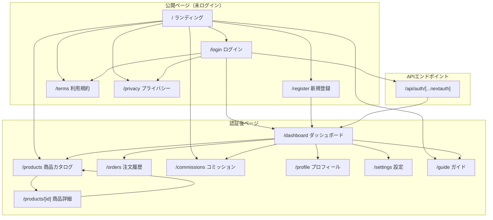

### 2.2 ページ別遷移テーブル

| 現在のページ | ページ内要素 | 遷移先 | 条件 |
|-------------|-------------|--------|------|
| `/` | ロゴ | `/` | - |
| `/` | ヘッダー「品揃え」 | `/products` | - |
| `/` | ヘッダー「Tips」 | `/guide` | - |
| `/` | ヘッダー「高報酬！」 | `/commissions` | - |
| `/` | ヘッダー「ダッシュボード」 | `/dashboard` | 認証必要 |
| `/` | Hero「無料で始める」 | `/register` | - |
| `/` | Hero「使い方を見る」 | デモ動画モーダル | - |
| `/` | フッター「利用規約」 | `/terms` | - |
| `/` | フッター「プライバシー」 | `/privacy` | - |
| `/login` | 「TikTokでログイン」 | TikTok OAuth → `/dashboard` | - |
| `/login` | 「利用規約」リンク | `/terms` | - |
| `/login` | 「プライバシーポリシー」リンク | `/privacy` | - |
| `/login` | 「アカウント作成」リンク | `/register` | - |
| `/register` | 「ログイン」リンク | `/login` | - |
| `/register` | 登録完了 | `/dashboard` | - |
| `/dashboard` | クイックアクション「商品を探す」 | `/products` | - |
| `/dashboard` | クイックアクション「コミッション確認」 | `/commissions` | - |
| `/dashboard` | クイックアクション「ヘルプセンター」 | `/guide` | - |
| `/dashboard` | 最近の注文「すべて見る」 | `/orders` | - |
| `/products` | 商品カード クリック | `/products/[id]` | - |
| `/products` | 「Sample」ボタン | GetSampleModal | - |
| `/products` | 「Add」ボタン | AddAffiliateModal | - |
| `/products/[id]` | 戻る矢印 | `/products` | - |
| `/products/[id]` | 「サンプルを申請」 | GetSampleModal | - |
| `/products/[id]` | 「アフィリエイトに追加」 | AddAffiliateModal | - |
| `/products/[id]` | 「商品ページ」 | 外部（TikTok Shop） | - |
| `/products/[id]` | 関連商品カード | `/products/[otherId]` | - |
| `/orders` | 「CSVダウンロード」 | ファイルダウンロード | - |
| `/commissions` | 「振込申請」 | RequestPayoutModal | - |
| `/profile` | 「Unlock」ボタン | `/commissions` | - |

### 2.3 サイドバー遷移（認証後ページ共通）

| メニュー項目 | アイコン | 遷移先 |
|-------------|---------|--------|
| ダッシュボード | LayoutDashboard | `/dashboard` |
| 商品カタログ | Package | `/products` |
| 注文履歴 | ShoppingCart | `/orders` |
| コミッション | DollarSign | `/commissions` |
| 設定 | Settings | `/settings` |
| ヘルプ | HelpCircle | `/guide` |
| ログアウト | LogOut | `/login`（セッション破棄） |

---

## 3. 全ページ一覧

### 3.1 公開ページ（Public）

#### `/` - ランディングページ

| セクション | コンポーネント | 内容 |
|-----------|--------------|------|
| Header | `Header.tsx` | ロゴ、ナビゲーション（品揃え/Tips/高報酬！/ダッシュボード）、通知ベル、ユーザーメニュー |
| Hero | `HeroSection.tsx` | メインビジュアル、キャッチコピー、CTAボタン（無料で始める/使い方を見る）、信頼バッジ |
| Stats | `StatsSection.tsx` | 統計数値（10,000+ users, 25% commission, etc） |
| Features | `FeaturesSection.tsx` | 機能紹介（3カラム） |
| HowItWorks | `HowItWorksSection.tsx` | 使い方フロー（4ステップ） |
| FAQ | `FAQSection.tsx` | よくある質問（アコーディオン） |
| CTA | `CTASection.tsx` | 最終CTAブロック |
| Footer | `Footer.tsx` | リンク集、著作権表示 |

#### `/login` - TikTokログイン

| 要素 | 内容 |
|------|------|
| タイトル | 「AnyBrandにログイン」 |
| サブタイトル | 「TikTokアカウントで簡単にログイン」 |
| TikTokボタン | TikTok OAuth開始（カスタムSVGアイコン） |
| ベネフィット表示 | 3項目（コミッション追跡/商品アクセス/リアルタイム分析） |
| フッターリンク | 利用規約、プライバシーポリシー |

#### `/register` - 新規登録

| ステップ | 内容 |
|---------|------|
| Step 1 | TikTokアカウント連携 |
| Step 2 | プロフィール情報入力 |
| Step 3 | カテゴリ選択 |

#### `/terms` - 利用規約

| 要素 | 内容 |
|------|------|
| タイトル | 「利用規約」 |
| 本文 | 法的条項（静的テキスト） |

#### `/privacy` - プライバシーポリシー

| 要素 | 内容 |
|------|------|
| タイトル | 「プライバシーポリシー」 |
| 本文 | 個人情報取扱方針（静的テキスト） |

### 3.2 認証後ページ（Auth）

#### `/dashboard` - ダッシュボード

| セクション | 内容 |
|-----------|------|
| 統計カード（4枚） | 総売上、総コミッション、保留中コミッション、総クリック数 |
| 売上推移グラフ | Recharts AreaChart（月別売上・コミッション） |
| クイックアクション | 商品を探す、コミッション確認、ヘルプセンター |
| 最近の注文 | テーブル表示（商品名、金額、ステータス、日時） |
| 通知セクション | 新着通知一覧 |

**統計カード詳細**:
| カード | アイコン | 値の例 | 変化率 |
|--------|---------|--------|--------|
| 総売上 | DollarSign | ¥1,234,567 | +12.5% |
| 総コミッション | Wallet | ¥123,456 | +8.3% |
| 保留中コミッション | Clock | ¥12,345 | - |
| 総クリック数 | MousePointer | 45,678 | +15.2% |

#### `/products` - 商品カタログ

| 要素 | 内容 |
|------|------|
| 検索バー | キーワード検索 |
| カテゴリフィルター | 6カテゴリ（タブ/ドロップダウン） |
| ソートタブ | 7種類（後述） |
| 表示切替 | グリッド / リスト |
| 商品一覧 | ProductCard（グリッド5列） / ProductListItem（リスト） |
| ページネーション | 前へ / ページ番号 / 次へ |

**ソートタブ（7種類）**:
| タブ | ソートキー | デフォルト順 | クリック動作 |
|------|----------|-------------|-------------|
| 総売上 | `totalSold` | 降順 | 同タブ再クリックで昇順切替 |
| 昨日の売上 | `soldYesterday` | 降順 | 〃 |
| 獲得額 | `earnPerSale` | 降順 | 〃 |
| コミッション率 | `maxCommissionRate` | 降順 | 〃 |
| GMV | `gmv` | 降順 | 〃 |
| 評価 | `rating` | 降順 | 〃 |
| 価格 | `priceMin` | 昇順 | 〃 |

**カテゴリフィルター（6種類）**:
| カテゴリ | アイコン | 商品数 |
|---------|---------|--------|
| 美容・コスメ | Sparkles | 120件 |
| 食品・健康 | Apple | 45件 |
| 家電・ガジェット | Smartphone | 38件 |
| ファッション | Shirt | 52件 |
| ホーム・インテリア | Home | 28件 |
| その他 | MoreHorizontal | 16件 |

**検索機能**:
| 検索対象 | フィールド |
|---------|----------|
| 商品名 | `name` |
| ブランド名 | `brandName` |
| 説明文 | `description` |

**実装**: クライアントサイドフィルタリング（`filter()` + `includes()`）

**バッジシステム**:
| バッジ | 表示条件 | スタイル |
|--------|---------|---------|
| `top-selling` | `isTopSelling === true` | オレンジ背景 |
| `free-sample` | `hasSample === true` | 緑背景 |
| `new` | 登録7日以内 | 青背景 |
| `hot` | `soldYesterday > 100` | 赤背景 |

**表示切替**:
| モード | レイアウト | 列数 |
|--------|----------|------|
| グリッド | ProductCard | 5列（xl）/ 4列（lg）/ 3列（md）/ 2列（sm） |
| リスト | ProductListItem | 1列 |

**ページネーション**:
| 要素 | 機能 |
|------|------|
| 前へ | 前のページへ（1ページ目では無効） |
| ページ番号 | 該当ページへジャンプ |
| 次へ | 次のページへ（最終ページでは無効） |
| 表示件数 | 1ページあたり20件 |

#### `/products/[id]` - 商品詳細

| セクション | 内容 |
|-----------|------|
| パンくず | ホーム > 商品カタログ > 商品名 |
| 商品画像 | メイン画像（大） |
| 商品情報 | 名前、ブランド、カテゴリ、説明 |
| バッジ | top-selling / free-sample / new / hot |
| 価格情報 | 価格範囲、コミッション率（現在→最大）、獲得額 |
| 統計ボックス（4種） | 平均再生数、平均注文数、総売上、昨日の売上 |
| アクションボタン（4種） | サンプル申請、アフィリエイト追加、シェア、商品ページ |
| 関連商品 | 同カテゴリ商品5件 |
| Tips | アフィリエイトのコツ |

**統計ボックス詳細**:
| ボックス | 値の例 | 説明 |
|---------|--------|------|
| 平均再生数 | 125.3K | avgViews |
| 平均注文数 | 1,234 | avgOrders |
| 総売上 | 45,678 | totalSold |
| 昨日の売上 | 123 | soldYesterday |

**アクションボタン詳細**:
| ボタン | アイコン | アクション |
|--------|---------|----------|
| サンプルを申請 | Gift | GetSampleModal 表示 |
| アフィリエイトに追加 | Plus | AddAffiliateModal 表示 |
| シェア | Share2 | シェアダイアログ（未実装） |
| 商品ページ | ExternalLink | 外部リンク（TikTok Shop） |

#### `/orders` - 注文履歴

| 要素 | 内容 |
|------|------|
| ステータスフィルター | すべて / 完了 / 保留中 / キャンセル |
| 期間フィルター | すべて / 7日間 / 30日間 / 90日間 |
| 検索バー | 注文ID、商品名検索 |
| CSVダウンロード | 表示中データのエクスポート |
| 注文テーブル | ID、商品、金額、コミッション、ステータス、日時 |

**ステータスバッジ**:
| ステータス | 色 | 表示 |
|-----------|-----|------|
| completed | 緑 | 完了 |
| pending | 黄 | 保留中 |
| cancelled | 赤 | キャンセル |

#### `/commissions` - コミッション

| セクション | 内容 |
|-----------|------|
| 統計カード（4枚） | 総獲得額、今月の獲得額、保留中、振込済み |
| 獲得推移グラフ | Recharts AreaChart（月別コミッション） |
| 振込申請ボタン | RequestPayoutModal 表示 |
| 振込履歴テーブル | ID、金額、ステータス、申請日、支払日 |

#### `/profile` - プロフィール

| セクション | 内容 |
|-----------|------|
| ProfileSidebar | アバター、ユーザー名、TikTok ID |
| 統計カード（5種） | フォロワー数、フォロー数、いいね数、動画数、Bio |
| カテゴリ選択 | 興味のあるカテゴリを選択 |
| Unlock カード | 「Unlock your Commission」→ `/commissions` |

**TikTok統計表示**:
| 項目 | アイコン | 値の例 | 説明 |
|------|---------|--------|------|
| Followers | Users | 125.3K | followerCount |
| Following | UserPlus | 234 | followingCount |
| Likes | Heart | 1.2M | likesCount |
| Videos | Video | 156 | videoCount |
| Bio | FileText | テキスト | bioDescription |

#### `/settings` - 設定

| セクション | 内容 |
|-----------|------|
| プロフィール設定 | 表示名、メールアドレス |
| 通知設定 | メール通知、プッシュ通知 |
| 支払い設定 | 銀行口座情報 |
| アカウント | ログアウト、アカウント削除 |

#### `/guide` - ガイド・ヘルプ

| セクション | 内容 |
|-----------|------|
| はじめに | プラットフォームの使い方 |
| サンプル申請方法 | 3ステップガイド |
| アフィリエイト追加方法 | 3オプション解説 |
| コミッションについて | 計算方法、支払いサイクル |
| よくある質問 | FAQ |

---

## 4. 認証フロー（TikTok OAuth）

### 4.1 認証構成

```
src/auth.ts
├─ TikTokProvider（カスタムOAuthプロバイダー）
│  ├─ ID: "tiktok"
│  ├─ Name: "TikTok"
│  ├─ Type: "oauth"
│  │
│  ├─ Authorization URL
│  │  └─ https://www.tiktok.com/v2/auth/authorize
│  │
│  ├─ Token URL
│  │  └─ https://open.tiktokapis.com/v2/oauth/token/
│  │
│  ├─ UserInfo URL
│  │  └─ https://open.tiktokapis.com/v2/user/info/
│  │     ?fields=open_id,display_name,avatar_url,follower_count,
│  │             following_count,likes_count,video_count,bio_description
│  │
│  └─ Scopes
│     ├─ user.info.basic
│     ├─ user.info.profile
│     └─ user.info.stats
│
├─ JWT Callback
│  └─ TikTok プロフィール情報をトークンに保存
│     ├─ openId
│     ├─ displayName
│     ├─ avatarUrl
│     ├─ followerCount
│     ├─ followingCount
│     ├─ likesCount
│     ├─ videoCount
│     └─ bioDescription
│
└─ Session Callback
   └─ トークンからセッションにTikTok情報を追加
      └─ session.user.tiktok = { ... }
```

### 4.2 ログインフロー

```
1. ユーザー: `/login` ページにアクセス
   │
2. ユーザー: 「TikTokでログイン」ボタンをクリック
   │
3. フロントエンド: signIn("tiktok", { callbackUrl: "/dashboard" }) 実行
   │
4. NextAuth: TikTok Authorization URLにリダイレクト
   │  URL: https://www.tiktok.com/v2/auth/authorize
   │  Parameters:
   │    - client_key: TIKTOK_CLIENT_KEY
   │    - scope: user.info.basic,user.info.profile,user.info.stats
   │    - response_type: code
   │    - redirect_uri: /api/auth/callback/tiktok
   │
5. TikTok: ユーザー認可画面を表示
   │
6. ユーザー: 「許可」をクリック
   │
7. TikTok: Authorization codeを含めてリダイレクト
   │  URL: /api/auth/callback/tiktok?code=xxx
   │
8. NextAuth: Token URLにPOSTリクエスト
   │  URL: https://open.tiktokapis.com/v2/oauth/token/
   │  Body: { code, client_key, client_secret, grant_type }
   │
9. TikTok: access_token, refresh_token を返却
   │
10. NextAuth: UserInfo URLにGETリクエスト
    │  URL: https://open.tiktokapis.com/v2/user/info/
    │  Headers: { Authorization: Bearer {access_token} }
    │
11. TikTok: ユーザー情報を返却
    │  {
    │    open_id, display_name, avatar_url,
    │    follower_count, following_count,
    │    likes_count, video_count, bio_description
    │  }
    │
12. NextAuth: JWT Callback でトークンに情報を保存
    │
13. NextAuth: Session Callback でセッションを構築
    │
14. フロントエンド: `/dashboard` にリダイレクト
    │
15. 完了: ログイン状態でダッシュボード表示
```

### 4.3 環境変数

| 変数名 | 値の例 | 説明 |
|--------|--------|------|
| `TIKTOK_CLIENT_KEY` | `sbawiwbkmavphg50ju` | TikTok Developer Portal Client Key |
| `TIKTOK_CLIENT_SECRET` | `VLsLhZ8h...` | TikTok Developer Portal Client Secret |
| `NEXTAUTH_SECRET` | `your_secret_key` | NextAuth暗号化キー |
| `NEXTAUTH_URL` | `http://localhost:3000` | コールバックURL |

### 4.4 TikTok Developer Portal設定

| 項目 | Sandbox | Production |
|------|---------|------------|
| App Name | AnyBrand | AnyBrand |
| Client Key | `sb...` | Production Key |
| Redirect URI | `http://localhost:3000/api/auth/callback/tiktok` | `https://anybrand-platform.vercel.app/api/auth/callback/tiktok` |
| Scopes | user.info.basic, user.info.profile, user.info.stats | 同左 |
| 審査状態 | テスト可能 | 審査待ち |

### 4.5 セッション型拡張

```typescript
// 拡張されたSession型
interface Session {
  user: {
    id?: string
    name?: string | null
    email?: string | null
    image?: string | null
    tiktok?: TikTokProfile
    accessToken?: string
  }
}

// TikTokプロフィール型
interface TikTokProfile {
  openId: string          // TikTok固有ID
  displayName: string     // ユーザー名
  avatarUrl: string       // アバター画像URL
  followerCount: number   // フォロワー数
  followingCount: number  // フォロー数
  likesCount: number      // いいね数
  videoCount: number      // 動画数
  bioDescription?: string // プロフィール説明
}
```

---

## 5. UIコンポーネント別遷移

### 5.1 Header（公開ページ用）

**ファイル**: `src/components/layout/Header.tsx`

| 要素 | タイプ | 遷移先 / アクション | 条件 |
|------|--------|-------------------|------|
| ロゴ（AnyBrand） | Link | `/` | - |
| 「品揃え」 | Link | `/products` | - |
| 「Tips」 | Link | `/guide` | - |
| 「高報酬！」 | Link | `/commissions` | - |
| 「ダッシュボード」 | Link | `/dashboard` | 認証必要 |
| 通知ベル | Button | 通知ドロップダウン表示 | ログイン済 |
| ユーザーアバター | Button | ユーザーメニュー表示 | ログイン済 |
| 「ログイン」 | Link | `/login` | 未ログイン |
| モバイルメニュー | Button | ナビゲーション展開 | モバイル |

**ユーザーメニュー（ドロップダウン）**:
| 項目 | アイコン | 遷移先 |
|------|---------|--------|
| プロフィール | User | `/profile` |
| 設定 | Settings | `/settings` |
| ログアウト | LogOut | `/login`（セッション破棄） |

### 5.2 Sidebar（認証後ページ用）

**ファイル**: `src/components/layout/Sidebar.tsx`

| 要素 | アイコン | 遷移先 | アクティブ判定 |
|------|---------|--------|---------------|
| ロゴ（AnyBrand） | - | `/dashboard` | - |
| ダッシュボード | LayoutDashboard | `/dashboard` | pathname === '/dashboard' |
| 商品カタログ | Package | `/products` | pathname.startsWith('/products') |
| 注文履歴 | ShoppingCart | `/orders` | pathname === '/orders' |
| コミッション | DollarSign | `/commissions` | pathname === '/commissions' |
| 設定 | Settings | `/settings` | pathname === '/settings' |
| ヘルプ | HelpCircle | `/guide` | pathname === '/guide' |
| 折りたたみボタン | ChevronLeft/Right | サイドバー幅トグル | - |
| ユーザー情報 | - | 表示のみ | - |
| ログアウト | LogOut | `/login`（セッション破棄） | - |

**サイドバー状態**:
| 状態 | 幅 | メニュー表示 |
|------|-----|-------------|
| 展開 | 256px | アイコン + テキスト |
| 折りたたみ | 80px | アイコンのみ |

### 5.3 Footer

**ファイル**: `src/components/layout/Footer.tsx`

| セクション | リンク | 遷移先 |
|-----------|--------|--------|
| プロダクト | 機能 | `/products` |
| プロダクト | 料金 | `/commissions` |
| プロダクト | ガイド | `/guide` |
| サポート | ヘルプセンター | `/guide` |
| サポート | お問い合わせ | mailto: |
| 法的情報 | 利用規約 | `/terms` |
| 法的情報 | プライバシー | `/privacy` |
| SNS | TikTok | 外部リンク |

### 5.4 ProductCard

**ファイル**: `src/app/(auth)/products/page.tsx` 内

| 要素 | アクション |
|------|----------|
| カード全体クリック | `/products/[id]` に遷移 |
| 画像 | `/products/[id]` に遷移 |
| 商品名 | `/products/[id]` に遷移 |
| 「Sample」ボタン | GetSampleModal 表示 |
| 「Add」ボタン | AddAffiliateModal 表示 |
| お気に入りアイコン | LocalStorageに保存（UI更新） |

**カード表示情報**:
| 要素 | 表示内容 |
|------|---------|
| 画像 | `imageUrl` |
| バッジ | `badges[]` (top-selling, free-sample, new, hot) |
| 商品名 | `name` |
| ブランド | `brandName` |
| 価格 | `¥${priceMin.toLocaleString()} - ¥${priceMax.toLocaleString()}` |
| コミッション | `${commissionRate}% → ${maxCommissionRate}%` |
| 獲得額 | `¥${earnPerSale.toLocaleString()}/sale`（緑・太字） |

### 5.5 ProductListItem

**ファイル**: `src/app/(auth)/products/page.tsx` 内

リスト表示時のアイテム。ProductCardと同様の遷移だが、水平レイアウト。

---

## 6. モーダル・ポップアップ

### 6.1 AddAffiliateModal

**ファイル**: `src/components/modals/AddAffiliateModal.tsx`

**トリガー**:
- 商品カードの「Add」ボタン
- 商品詳細ページの「アフィリエイトに追加」ボタン
- 商品詳細ページの「アフィリエイト承認済み」ボタン

**構成**:

```
┌─────────────────────────────────────────────┐
│ [×]                                         │
│                                             │
│    アフィリエイトに追加                      │
│    {商品名}                                 │
│                                             │
├─────────────────────────────────────────────┤
│ Option 1: TikTok Shopアプリで追加           │
│ ┌───────────────────┐                       │
│ │    [QRコード]      │ ← product.affiliateUrl │
│ │                   │                       │
│ └───────────────────┘                       │
│ TikTok Shopアプリでスキャン                 │
│ してこの商品を追加                          │
├─────────────────────────────────────────────┤
│ Option 2: リンクをコピー                    │
│ ┌─────────────────────────────┬────────┐   │
│ │ https://shop.tiktok.com/... │ コピー │   │
│ └─────────────────────────────┴────────┘   │
│ コピー成功時: ✓ コピーしました              │
├─────────────────────────────────────────────┤
│ Option 3: PC版で操作                        │
│ TikTok Shop Seller Centerにアクセス         │
│ [Seller Centerを開く] → 外部リンク          │
└─────────────────────────────────────────────┘
```

**QRコードURL**:
- `product.affiliateUrl` を使用（実TikTokアフィリエイトURL）
- 例: `https://shop.tiktok.com/affiliate/product/123456`

**コピー機能**:
- クリップボードにURLをコピー
- 成功時にチェックマークアイコン表示

**外部リンク**:
- `https://seller-us.tiktok.com/affiliate/creator` に遷移

### 6.2 GetSampleModal

**ファイル**: `src/components/modals/GetSampleModal.tsx`

**トリガー**:
- 商品カードの「Sample」ボタン
- 商品詳細ページの「サンプルを申請」ボタン

**構成**:

```
┌─────────────────────────────────────────────┐
│ [×]                                         │
│                                             │
│    サンプルを申請                            │
│    {商品名}                                 │
│                                             │
├─────────────────────────────────────────────┤
│ Step 1: TikTok Shopを開く                   │
│ ┌───────────────────┐                       │
│ │    [QRコード]      │ ← TikTok Shop URL    │
│ │                   │                       │
│ └───────────────────┘                       │
│ TikTok Shopアプリでスキャンして             │
│ Sample Centerにアクセス                     │
├─────────────────────────────────────────────┤
│ Step 2: 商品を検索                          │
│ ┌─────────────────────────────┬────────┐   │
│ │ {商品名}                    │ コピー │   │
│ └─────────────────────────────┴────────┘   │
│ この商品名をコピーしてアプリ内で検索        │
├─────────────────────────────────────────────┤
│ Step 3: サンプルを申請                      │
│ 商品ページで「Get Free Sample」を           │
│ タップしてサンプルをリクエスト             │
└─────────────────────────────────────────────┘
```

**QRコードURL**:
- `https://shop.tiktok.com/view/product/${product.id}`

**コピー機能**:
- 商品名をクリップボードにコピー

### 6.3 RequestPayoutModal

**トリガー**: `/commissions` ページの「振込申請」ボタン

**構成**:
- 振込先銀行口座確認
- 振込金額入力（最低金額制限あり）
- 確認・送信

### 6.4 UserDropdown

**トリガー**: Header/Sidebarのユーザーアバタークリック

**構成**:
| 項目 | 遷移先 |
|------|--------|
| プロフィール | `/profile` |
| 設定 | `/settings` |
| ログアウト | `/login`（セッション破棄） |

---

## 7. 外部リンク一覧

### 7.1 TikTok連携

| 連携先 | URL | 用途 |
|--------|-----|------|
| TikTok OAuth | `https://www.tiktok.com/v2/auth/authorize` | ログイン認証 |
| TikTok Token API | `https://open.tiktokapis.com/v2/oauth/token/` | トークン交換 |
| TikTok User API | `https://open.tiktokapis.com/v2/user/info/` | ユーザー情報取得 |
| TikTok Shop | `https://shop.tiktok.com/` | 商品ページ |
| TikTok Seller Center | `https://seller-us.tiktok.com/affiliate/creator` | PC版操作 |

### 7.2 QRコード生成

**ライブラリ**: `qrcode.react`

| 用途 | URL形式 |
|------|---------|
| アフィリエイト追加 | `product.affiliateUrl` |
| サンプル申請 | `https://shop.tiktok.com/view/product/${product.id}` |

### 7.3 外部リンク一覧

| リンク名 | URL | 用途 |
|---------|-----|------|
| TikTok Shop 商品ページ | `https://shop.tiktok.com/view/product/{id}` | 商品詳細 |
| TikTok Shop Affiliate | `https://shop.tiktok.com/affiliate/product/{id}` | アフィリエイト追加 |
| TikTok Seller Center | `https://seller-us.tiktok.com/affiliate/creator` | PC版管理 |
| anystarr.com | `https://anystarr.com/` | UIベースモデル |

---

## 8. 認証状態による条件分岐

### 8.1 ページアクセス制御

```
ユーザー訪問
│
├─ 未ログイン
│   ├─ `/` → 表示OK（ランディング）
│   ├─ `/login` → 表示OK
│   ├─ `/register` → 表示OK
│   ├─ `/terms` → 表示OK
│   ├─ `/privacy` → 表示OK
│   ├─ `/dashboard` → `/login` にリダイレクト
│   ├─ `/products` → `/login` にリダイレクト
│   ├─ `/orders` → `/login` にリダイレクト
│   ├─ `/commissions` → `/login` にリダイレクト
│   ├─ `/profile` → `/login` にリダイレクト
│   └─ `/settings` → `/login` にリダイレクト
│
└─ ログイン済
    ├─ `/` → 表示OK（またはダッシュボードにリダイレクト）
    ├─ `/login` → `/dashboard` にリダイレクト
    ├─ `/register` → `/dashboard` にリダイレクト
    ├─ `/dashboard` → 表示OK
    ├─ `/products` → 表示OK
    ├─ `/products/[id]` → 表示OK
    ├─ `/orders` → 表示OK
    ├─ `/commissions` → 表示OK
    ├─ `/profile` → 表示OK
    ├─ `/settings` → 表示OK
    └─ `/guide` → 表示OK
```

### 8.2 UI要素の条件分岐

| コンポーネント | 要素 | 未ログイン | ログイン済 |
|--------------|------|-----------|-----------|
| Header | 通知ベル | 非表示 | 表示 |
| Header | ユーザーアバター | 非表示 | 表示 |
| Header | ログインボタン | 表示 | 非表示 |
| Header | ダッシュボードリンク | クリック→ログイン | 直接遷移 |
| Sidebar | 全体 | 非表示 | 表示 |
| ランディング | CTA文言 | 「無料で始める」 | 「ダッシュボードへ」 |

### 8.3 ミドルウェア実装

**ファイル**: `src/middleware.ts`

```typescript
export const config = {
  matcher: [
    '/dashboard/:path*',
    '/products/:path*',
    '/orders/:path*',
    '/commissions/:path*',
    '/profile/:path*',
    '/settings/:path*',
    '/guide/:path*',
  ]
}
```

**動作**:
- マッチしたパスにアクセス時、セッションをチェック
- セッションなし → `/login` にリダイレクト
- セッションあり → リクエスト続行

---

## 9. コンポーネント構造

### 9.1 ディレクトリツリー

```
webapp/src/
├── app/
│   ├── (auth)/                      # 認証後ページグループ
│   │   ├── dashboard/
│   │   │   └── page.tsx             # ダッシュボード
│   │   ├── products/
│   │   │   ├── page.tsx             # 商品カタログ
│   │   │   └── [id]/
│   │   │       └── page.tsx         # 商品詳細
│   │   ├── orders/
│   │   │   └── page.tsx             # 注文履歴
│   │   ├── commissions/
│   │   │   └── page.tsx             # コミッション
│   │   ├── profile/
│   │   │   └── page.tsx             # プロフィール
│   │   ├── settings/
│   │   │   └── page.tsx             # 設定
│   │   ├── guide/
│   │   │   └── page.tsx             # ガイド
│   │   └── layout.tsx               # Sidebar付きレイアウト
│   │
│   ├── (public)/                    # 公開ページグループ
│   │   ├── login/
│   │   │   └── page.tsx             # TikTokログイン
│   │   ├── register/
│   │   │   └── page.tsx             # 新規登録
│   │   ├── privacy/
│   │   │   └── page.tsx             # プライバシー
│   │   └── terms/
│   │       └── page.tsx             # 利用規約
│   │
│   ├── api/
│   │   └── auth/
│   │       └── [...nextauth]/
│   │           └── route.ts         # NextAuth APIルート
│   │
│   ├── page.tsx                     # ランディングページ
│   ├── layout.tsx                   # ルートレイアウト
│   ├── globals.css                  # グローバルスタイル
│   └── favicon.ico
│
├── components/
│   ├── layout/
│   │   ├── Header.tsx               # ヘッダー（公開ページ用）
│   │   ├── Sidebar.tsx              # サイドバー（認証後用）
│   │   └── Footer.tsx               # フッター
│   │
│   ├── landing/
│   │   ├── HeroSection.tsx          # ヒーローセクション
│   │   ├── StatsSection.tsx         # 統計セクション
│   │   ├── FeaturesSection.tsx      # 機能紹介
│   │   ├── HowItWorksSection.tsx    # 使い方フロー
│   │   ├── FAQSection.tsx           # FAQ
│   │   └── CTASection.tsx           # CTA
│   │
│   ├── modals/
│   │   ├── AddAffiliateModal.tsx    # アフィリエイト追加
│   │   ├── GetSampleModal.tsx       # サンプル申請
│   │   └── index.ts                 # エクスポート
│   │
│   ├── profile/
│   │   ├── ProfileSidebar.tsx       # プロフィールサイドバー
│   │   ├── StatCard.tsx             # 統計カード
│   │   └── index.ts                 # エクスポート
│   │
│   ├── providers/
│   │   └── SessionProvider.tsx      # NextAuth SessionProvider
│   │
│   └── video/
│       └── VideoPreview.tsx         # Remotion動画プレビュー
│
├── data/
│   ├── products-data.ts             # 商品データ（299件）
│   └── mock-data.ts                 # モックデータ（カテゴリ、統計等）
│
├── types/
│   └── index.ts                     # 全型定義
│
├── auth.ts                          # NextAuth + TikTok OAuth設定
├── middleware.ts                    # Next.js Middleware（認証チェック）
│
└── remotion/
    ├── compositions/
    │   ├── ProductVideo.tsx         # 10秒商品紹介動画
    │   └── TikTokDemoVideo.tsx      # 40秒デモ動画
    ├── Root.tsx                     # Remotionルート
    └── index.ts                     # エクスポート
```

### 9.2 主要ファイル説明

| ファイル | 行数 | 説明 |
|---------|------|------|
| `app/(auth)/products/page.tsx` | ~500 | 商品カタログ（検索・フィルター・ソート・モーダル） |
| `app/(auth)/products/[id]/page.tsx` | ~400 | 商品詳細（統計・アクション・関連商品） |
| `app/(auth)/dashboard/page.tsx` | ~300 | ダッシュボード（統計・グラフ・通知） |
| `app/(auth)/profile/page.tsx` | ~250 | プロフィール（TikTok連携表示） |
| `components/modals/AddAffiliateModal.tsx` | ~200 | アフィリエイト追加モーダル |
| `components/modals/GetSampleModal.tsx` | ~150 | サンプル申請モーダル |
| `components/layout/Sidebar.tsx` | ~150 | サイドバー |
| `data/products-data.ts` | ~3000 | 商品データ（299件） |
| `auth.ts` | ~150 | TikTok OAuth設定 |

---

## 10. データ構造

### 10.1 型定義ファイル

**ファイル**: `src/types/index.ts`

### 10.2 Product型

```typescript
interface Product {
  // 基本情報
  id: string
  name: string
  description: string
  brandName: string
  imageUrl: string

  // カテゴリ
  category: string
  categoryId: string

  // 価格情報
  price: number
  priceMin: number
  priceMax: number

  // コミッション
  commissionRate: number      // 現在のコミッション率
  maxCommissionRate: number   // 最大コミッション率
  earnPerSale: number         // 1件あたりの獲得額

  // 統計
  avgViews: number            // 平均再生数
  avgOrders: number           // 平均注文数
  totalSold: number           // 総売上数
  soldYesterday: number       // 昨日の売上数
  gmv: number                 // GMV
  rating: number              // 評価（5段階）

  // ステータス
  stock: number
  status: 'active' | 'inactive' | 'pending'
  hasSample: boolean          // サンプル有無
  isTopSelling: boolean       // トップセラー

  // バッジ
  badges: ProductBadge[]

  // TikTokCAP連携
  affiliateUrl?: string       // アフィリエイトURL
  shopUrl?: string            // 商品ページURL
  campaignPeriod?: string     // キャンペーン期間

  // 日時
  createdAt: string
}

type ProductBadge = 'top-selling' | 'free-sample' | 'new' | 'hot'
```

### 10.3 Category型

```typescript
interface Category {
  id: string
  name: string
  slug: string
  icon: string          // lucide-reactアイコン名
  productCount: number
}
```

**カテゴリ一覧**:
| id | name | slug | icon |
|----|------|------|------|
| 1 | 美容・コスメ | beauty | Sparkles |
| 2 | 食品・健康 | food-health | Apple |
| 3 | 家電・ガジェット | electronics | Smartphone |
| 4 | ファッション | fashion | Shirt |
| 5 | ホーム・インテリア | home | Home |
| 6 | その他 | other | MoreHorizontal |

### 10.4 Order型

```typescript
interface Order {
  id: string
  creatorId: string
  productId: string
  product: Product
  orderAmount: number
  commissionAmount: number
  status: 'pending' | 'completed' | 'cancelled'
  orderedAt: string
}
```

### 10.5 CommissionPayout型

```typescript
interface CommissionPayout {
  id: string
  creatorId: string
  amount: number
  status: 'pending' | 'processing' | 'paid'
  requestedAt: string
  paidAt?: string
}
```

### 10.6 DashboardStats型

```typescript
interface DashboardStats {
  totalSales: number
  totalCommission: number
  pendingCommission: number
  totalClicks: number
  conversionRate: number
  approvedProducts: number
  monthlyTrend: {
    month: string
    sales: number
    commission: number
  }[]
}
```

### 10.7 Creator型

```typescript
interface Creator {
  id: string
  email: string
  name: string
  tiktokUsername: string
  tiktokFollowers: number
  avatarUrl?: string
  status: 'active' | 'pending' | 'suspended'
  bankName?: string
  bankAccount?: string
  createdAt: string
  updatedAt: string
}
```

### 10.8 Notification型

```typescript
interface Notification {
  id: string
  title: string
  message: string
  type: 'info' | 'success' | 'warning' | 'error'
  read: boolean
  createdAt: string
}
```

---

## 11. API構造

### 11.1 NextAuth APIルート

**ファイル**: `src/app/api/auth/[...nextauth]/route.ts`

```typescript
import { handlers } from "@/auth"

export const { GET, POST } = handlers
```

**エンドポイント**:
| メソッド | パス | 説明 |
|---------|------|------|
| GET | `/api/auth/signin` | サインインページ |
| GET | `/api/auth/signout` | サインアウト |
| GET | `/api/auth/session` | セッション取得 |
| GET | `/api/auth/csrf` | CSRFトークン取得 |
| GET | `/api/auth/providers` | プロバイダー一覧 |
| GET | `/api/auth/callback/tiktok` | TikTok OAuthコールバック |
| POST | `/api/auth/signin/tiktok` | TikTokサインイン開始 |
| POST | `/api/auth/signout` | サインアウト実行 |

### 11.2 クライアントサイドAPI

**現在の実装**: すべてクライアントサイドでデータ処理（APIルートなし）

| 機能 | 実装方式 |
|------|---------|
| 商品一覧取得 | `products-data.ts` からimport |
| 商品検索 | クライアントサイドfilter |
| 商品ソート | クライアントサイドsort |
| 注文履歴 | `mock-data.ts` からimport |
| コミッション | `mock-data.ts` からimport |
| 統計 | `mock-data.ts` からimport |

### 11.3 将来のAPI構成（予定）

| エンドポイント | メソッド | 説明 |
|--------------|---------|------|
| `/api/products` | GET | 商品一覧取得 |
| `/api/products/[id]` | GET | 商品詳細取得 |
| `/api/orders` | GET | 注文履歴取得 |
| `/api/orders` | POST | 注文作成 |
| `/api/commissions` | GET | コミッション取得 |
| `/api/commissions/payout` | POST | 振込申請 |
| `/api/profile` | GET | プロフィール取得 |
| `/api/profile` | PUT | プロフィール更新 |

---

## 12. カラースキーム

### 12.1 ブランドカラー

| 名前 | HEX | RGB | 用途 |
|------|-----|-----|------|
| Primary | `#ff6b6b` | 255, 107, 107 | ボタン、アクティブ状態、CTA |
| Primary Hover | `#ee5a5a` | 238, 90, 90 | ホバー状態 |
| Accent Yellow | `#ffd93d` | 255, 217, 61 | 統計、ハイライト |
| Commission Green | `#4ade80` | 74, 222, 128 | コミッション、成功、獲得額 |
| Accent Blue | `#60a5fa` | 96, 165, 250 | リンク、アクセント |

### 12.2 背景色

| 名前 | HEX | 用途 |
|------|-----|------|
| Background | `#f3f3f3` | ページ背景 |
| Card Background | `#ffffff` | カード背景 |
| Sidebar Background | `#1f2937` | サイドバー背景（ダーク） |
| Input Background | `#f9fafb` | 入力フィールド背景 |

### 12.3 テキスト色

| 名前 | HEX | 用途 |
|------|-----|------|
| Text Primary | `#111827` | 主要テキスト |
| Text Secondary | `#6b7280` | 補助テキスト |
| Text Muted | `#9ca3af` | 薄いテキスト |
| Text Inverse | `#ffffff` | ダーク背景上のテキスト |

### 12.4 ステータス色

| ステータス | HEX | 用途 |
|-----------|-----|------|
| Success | `#10b981` | 成功、完了 |
| Warning | `#f59e0b` | 警告、保留 |
| Error | `#ef4444` | エラー、キャンセル |
| Info | `#3b82f6` | 情報 |

### 12.5 バッジ色

| バッジ | 背景色 | テキスト色 |
|--------|--------|----------|
| top-selling | `#ff6b6b` | `#ffffff` |
| free-sample | `#10b981` | `#ffffff` |
| new | `#3b82f6` | `#ffffff` |
| hot | `#f59e0b` | `#ffffff` |

---

## 13. 参考リンク

### 13.1 本番環境

| リンク | URL |
|--------|-----|
| 本番サイト | https://anybrand-platform.vercel.app |
| 本番商品カタログ | https://anybrand-platform.vercel.app/products |

### 13.2 開発環境

| リンク | URL |
|--------|-----|
| ローカル | http://localhost:3000 |
| Remotion Studio | http://localhost:3001 |

### 13.3 参考サイト

| サイト | URL | 関係 |
|--------|-----|------|
| anystarr.com | https://anystarr.com/ | UIベースモデル |
| TikTok Shop | https://shop.tiktok.com/ | 商品連携先 |
| TikTok Seller Center | https://seller-us.tiktok.com/ | PC版管理 |
| TikTok Developer Portal | https://developers.tiktok.com/ | OAuth設定 |

### 13.4 ドキュメント

| ドキュメント | URL |
|-------------|-----|
| Next.js | https://nextjs.org/docs |
| Auth.js (NextAuth v5) | https://authjs.dev/ |
| Tailwind CSS | https://tailwindcss.com/docs |
| Recharts | https://recharts.org/en-US/ |
| Remotion | https://www.remotion.dev/docs |
| TikTok Login Kit | https://developers.tiktok.com/doc/login-kit-web |

### 13.5 関連ファイル

| ファイル | パス | 説明 |
|---------|------|------|
| TikTokCAP CLAUDE.md | `/opperation/TikTokCAP/CLAUDE.md` | プロジェクト概要 |
| anystarr.md | `/opperation/TikTokCAP/webapp/docs/anystarr.md` | anystarr.comサイト構造 |
| products-data.ts | `/opperation/TikTokCAP/webapp/src/data/products-data.ts` | 商品データ（299件） |

---

## 更新履歴

- 2026-01-30: 構造統一（anystarr.mdと同じセクション順序・目次追加・「認証状態による条件分岐」独立セクション化）
- 2026-01-30: 初版作成（anystarr.mdと同等解像度、13セクション構成）
