# anystarr.com - 完全サイト構造マップ

TikTok公式アフィリエイトパートナー「anyStarr」の全ページ構造・遷移先・UI要素を完全に可視化したドキュメント。

---

## スクリーンショット

### 公開ページ（未ログイン）

| # | ページ | スクリーンショット |
|---|--------|-------------------|
| 01 | ランディング | 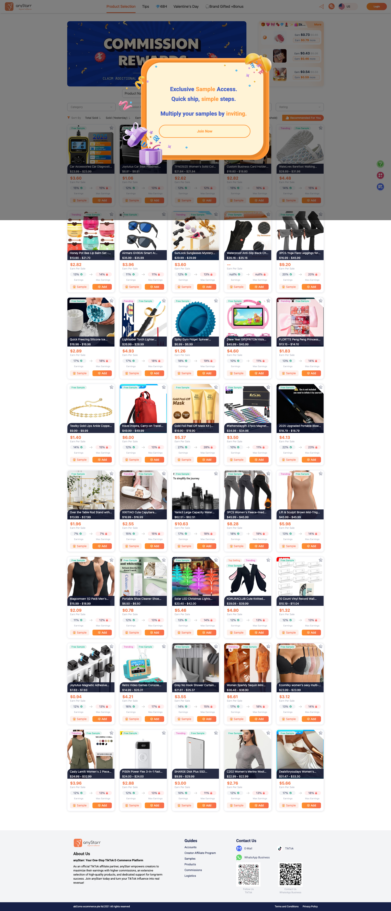 |
| 02 | ログイン | 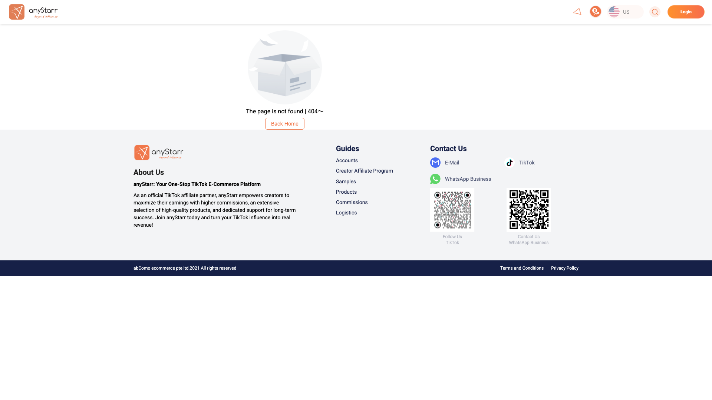 |
| 03 | 新規登録 |  |
| 04 | ヘルプセンター | 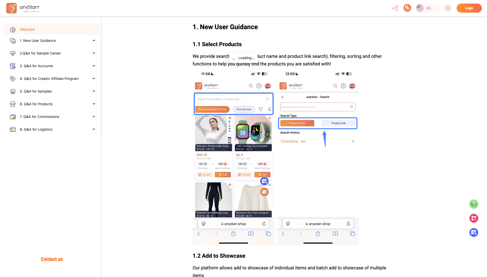 |
| 05 | Welcome |  |
| 06 | ガイド | 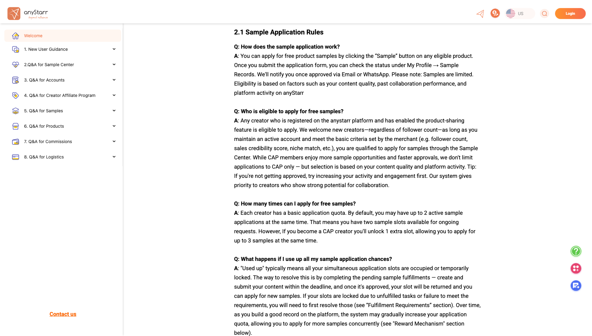 |
| 07 | アカウント | 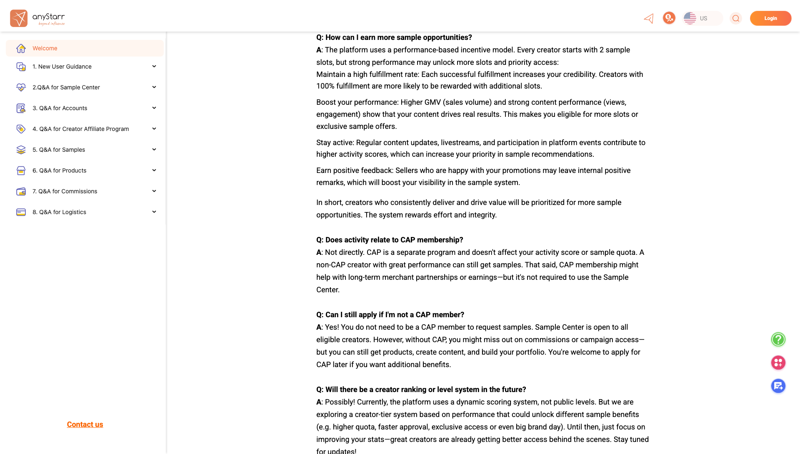 |
| 08 | 利用規約 | 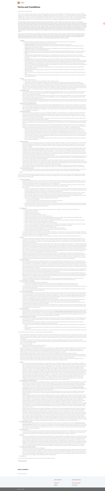 |
| 09 | プライバシー | 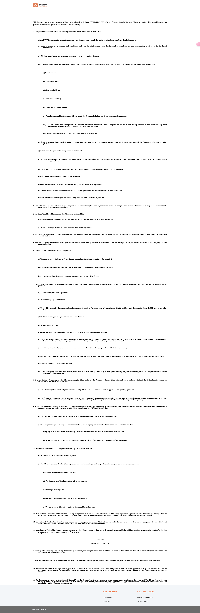 |

### 認証後ページ（ログイン必須）

| # | ページ | スクリーンショット |
|---|--------|-------------------|
| 10 | 商品詳細 | 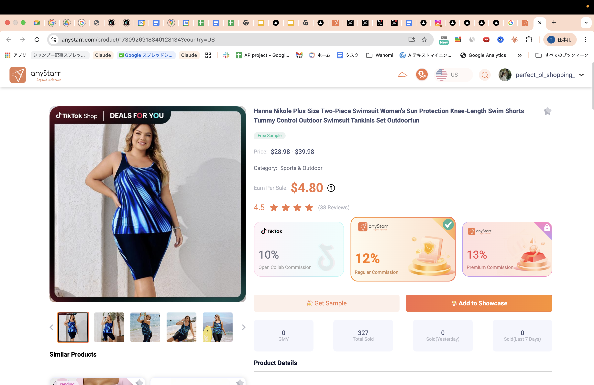 |
| 11 | Add to Showcaseモーダル | 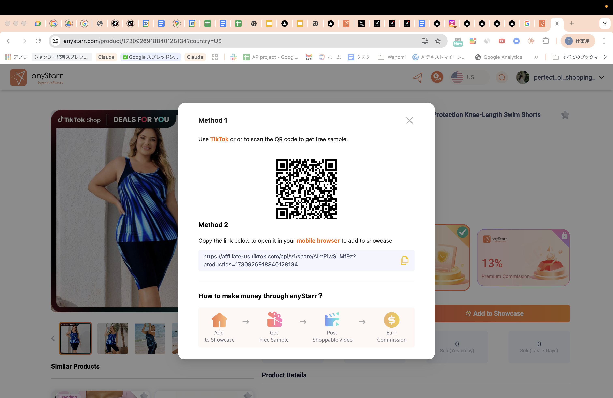 |
| 12 | Get Sampleモーダル（詳細から） | 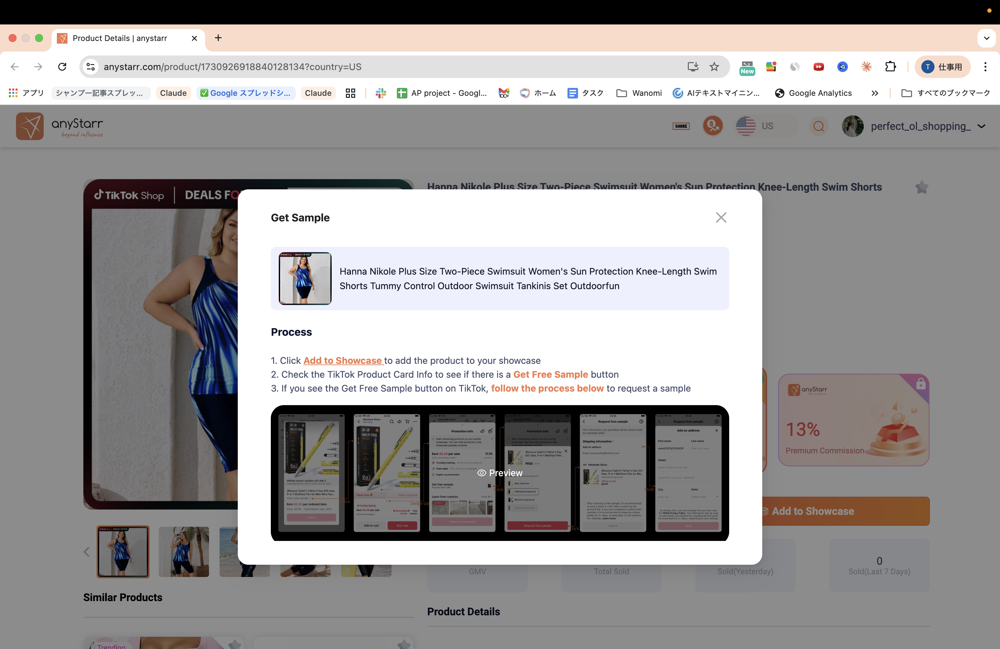 |
| 13 | 商品一覧 + Addモーダル | 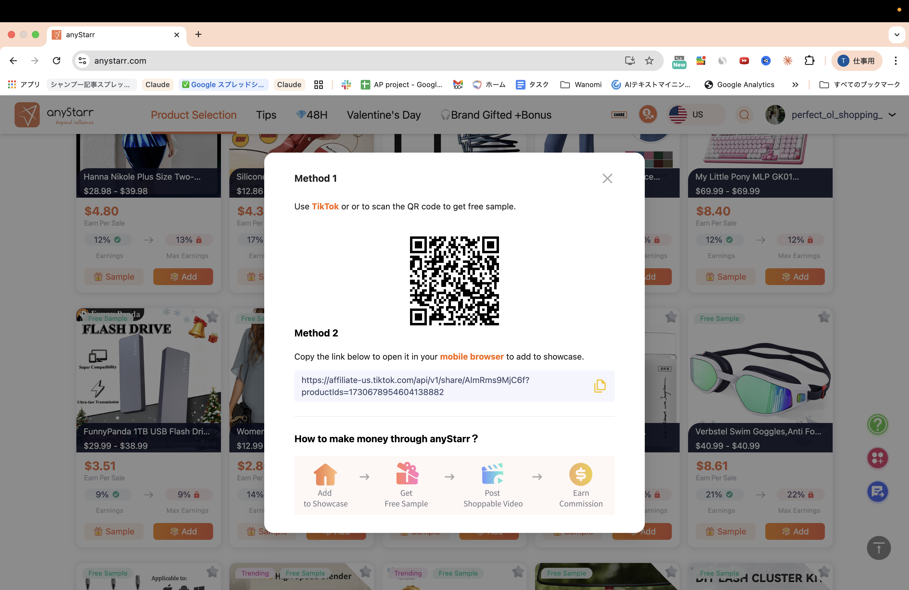 |
| 14 | 商品一覧 + Sampleモーダル | 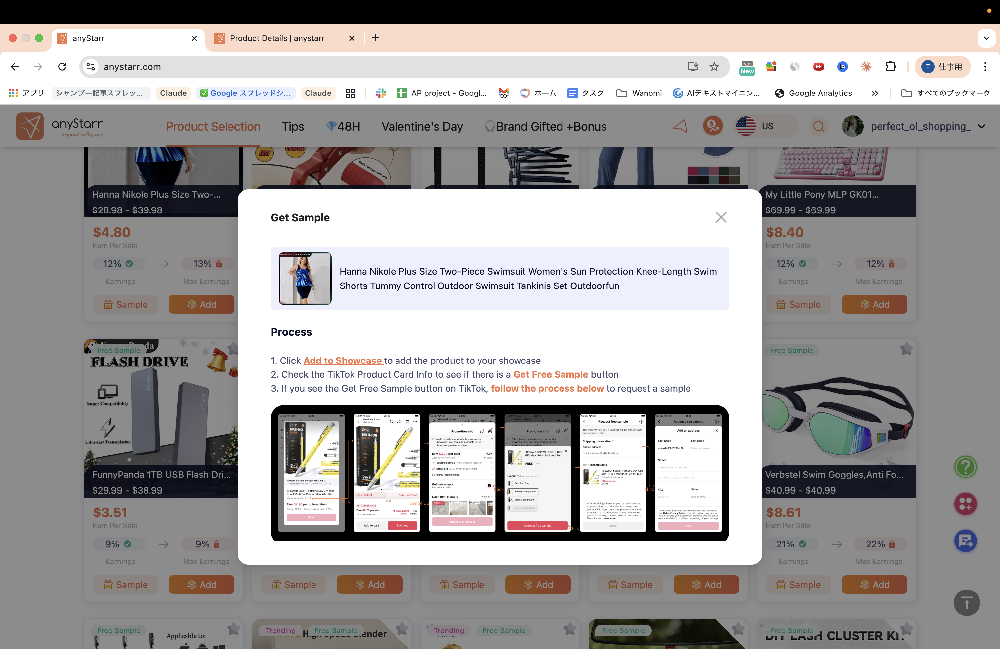 |
| 15 | プロフィール | 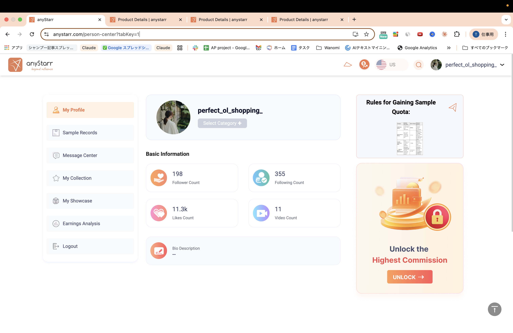 |

---

## 目次

1. [サイト概要](#1-サイト概要)
2. [ページ遷移マップ](#2-ページ遷移マップ)
3. [全ページ一覧](#3-全ページ一覧)
4. [ヘルプセンター完全構造](#4-ヘルプセンター完全構造)
5. [UIコンポーネント別遷移](#5-uiコンポーネント別遷移)
6. [モーダル・ポップアップ](#6-モーダルポップアップ)
7. [外部リンク一覧](#7-外部リンク一覧)
8. [認証状態による条件分岐](#8-認証状態による条件分岐)
9. [コンポーネント構造](#9-コンポーネント構造)
10. [データ構造](#10-データ構造)
11. [API構造](#11-api構造)
12. [カラースキーム](#12-カラースキーム)
13. [参考リンク](#13-参考リンク)

---

## 1. サイト概要

### 基本情報

| 項目 | 値 |
|------|-----|
| サイト名 | anyStarr |
| URL | https://anystarr.com |
| アプリURL | https://app.anystarr.com |
| 運営会社 | abComo ecommerce pte ltd. |
| 設立年 | 2020年（利用規約発効: 2020年11月1日） |
| 本社所在地 | シンガポール |
| コンセプト | Your One-Stop TikTok E-Commerce Platform |

### ターゲットユーザー

| セグメント | 説明 |
|-----------|------|
| TikTokクリエイター | アフィリエイト収益を得たいインフルエンサー |
| 副業希望者 | SNSで商品紹介をして副収入を得たい人 |
| EC事業者 | TikTok Shopでの販売を拡大したいブランド |

### 技術スタック

| 項目 | 技術 |
|------|------|
| フレームワーク | Next.js |
| フォント | Roboto (Google Fonts) |
| 分析 | Google Analytics (`G-RGC7VTRCE4`) |
| ページビルダー | Elementor (WordPress) ※法的ページ |
| 法準拠 | シンガポール PDPA (Personal Data Protection Act) |

### ビジネスモデル

```
┌─────────────┐     商品提供      ┌─────────────┐
│   ブランド   │ ───────────────→ │   anyStarr   │
│  (EC事業者)  │ ←─────────────── │  (プラット   │
└─────────────┘   コミッション    │   フォーム)  │
                                  └──────┬──────┘
                                         │
                     商品紹介・コミッション│
                                         │
                                  ┌──────▼──────┐
                                  │  クリエイター │
                                  │ (アフィリエイ │
                                  │    ター)     │
                                  └──────┬──────┘
                                         │
                        商品紹介・購入導線│
                                         │
                                  ┌──────▼──────┐
                                  │  消費者      │
                                  │ (TikTokユーザ│
                                  │    ー)       │
                                  └─────────────┘
```

---

## 2. ページ遷移マップ

### 2.1 全体フローチャート

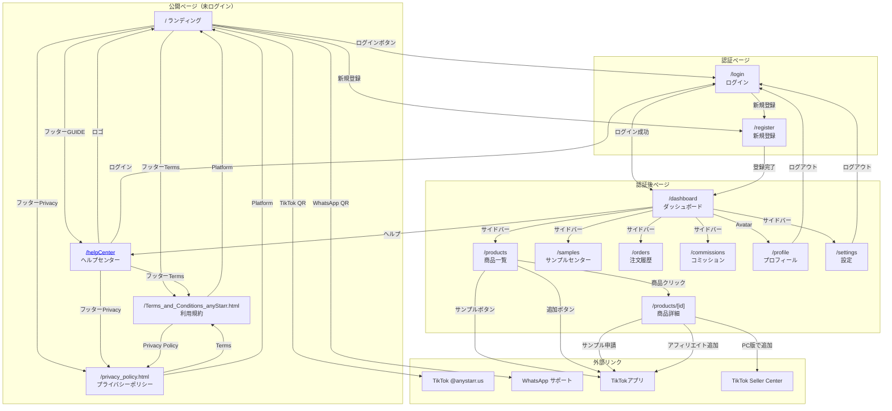

### 2.2 ページ別遷移テーブル

#### 公開ページ

| ページ | UI要素 | 遷移先 | 種別 |
|--------|--------|--------|------|
| **`/`** | ロゴ | `/` | 内部 |
| | ログインボタン | `/login` | 内部 |
| | フッター「Accounts」 | `/helpCenter?key=3.1` | 内部 |
| | フッター「Affiliate」 | `/helpCenter?key=4.1` | 内部 |
| | フッター「Samples」 | `/helpCenter?key=5.1` | 内部 |
| | フッター「Products」 | `/helpCenter?key=6.1` | 内部 |
| | フッター「Commissions」 | `/helpCenter?key=7.1` | 内部 |
| | フッター「Logistics」 | `/helpCenter?key=8.1` | 内部 |
| | フッター「Terms」 | `/Terms_and_Conditions_anyStarr.html` | 内部 |
| | フッター「Privacy」 | `/privacy_policy.html` | 内部 |
| | TikTok QRコード | `https://www.tiktok.com/@anystarr.us` | 外部 |
| | WhatsApp QRコード | `https://wa.me/15395677464` | 外部 |
| **`/helpCenter`** | ロゴ | `/` | 内部 |
| | ログインボタン | `/login` | 内部 |
| | サイドバー各項目 | `/helpCenter?key=X.X` | 内部 |
| | 人気トピック | `/helpCenter?key=X.X` | 内部 |
| | フッター（同上） | （同上） | - |
| **`/Terms_and_Conditions_anyStarr.html`** | Privacy Policy | `/privacy_policy.html` | 内部 |
| | Platform | `https://app.anystarr.com/en` | 外部 |
| | Contact | `mailto:contact@anystarr.com` | 外部 |
| | Google Play | Google Play Store | 外部 |
| | App Store | Apple App Store | 外部 |
| **`/privacy_policy.html`** | Terms | `/Terms_and_Conditions_anyStarr.html` | 内部 |
| | Platform | `https://app.anystarr.com/en` | 外部 |

#### 認証ページ

| ページ | UI要素 | 遷移先 | 種別 |
|--------|--------|--------|------|
| **`/login`** | TikTokログイン | TikTok OAuth → `/dashboard` | 外部→内部 |
| | メールログイン | `/dashboard` | 内部 |
| | 新規登録リンク | `/register` | 内部 |
| | パスワード忘れ | パスワードリセットフロー | 内部 |
| **`/register`** | TikTok連携 | TikTok OAuth | 外部 |
| | 登録完了 | `/dashboard` | 内部 |
| | ログインリンク | `/login` | 内部 |
| | Terms同意 | `/Terms_and_Conditions_anyStarr.html` | 内部 |
| | Privacy同意 | `/privacy_policy.html` | 内部 |

#### 認証後ページ

| ページ | UI要素 | 遷移先 | 種別 |
|--------|--------|--------|------|
| **`/dashboard`** | ロゴ | `/dashboard` | 内部 |
| | 品揃え | `/products` | 内部 |
| | Tips | `/helpCenter` | 内部 |
| | 高報酬！ | `/products?filter=high-commission` | 内部 |
| | 検索バー | `/products?search=XXX` | 内部 |
| | 通知ベル | 通知ドロップダウン | - |
| | Avatar | ユーザーメニュー | - |
| | サイドバー（後述） | 各ページ | 内部 |
| **`/products`** | 商品カード | `/products/[id]` | 内部 |
| | 「サンプル」ボタン | GetSampleModal → TikTokアプリ | 外部 |
| | 「追加」ボタン | AddAffiliateModal → TikTokアプリ | 外部 |
| | お気に入り | お気に入り追加（状態変更） | - |
| | カテゴリフィルター | `/products?category=XXX` | 内部 |
| | ソート | `/products?sort=XXX` | 内部 |
| **`/products/[id]`** | 「サンプル申請」 | GetSampleModal → TikTokアプリ | 外部 |
| | 「アフィリエイト追加」 | AddAffiliateModal → TikTokアプリ | 外部 |
| | 「PC版で追加」 | TikTok Seller Center | 外部 |
| | パンくずリスト | `/products` | 内部 |
| | 関連商品 | `/products/[related-id]` | 内部 |
| **`/samples`** | サンプル履歴アイテム | `/products/[id]` | 内部 |
| | ステータス確認 | 配送追跡（外部） | 外部 |
| **`/orders`** | 注文アイテム | `/products/[id]` | 内部 |
| | 追跡番号 | 配送追跡（外部） | 外部 |
| **`/commissions`** | 振込申請 | 銀行口座設定 → 申請確認 | 内部 |
| | 取引詳細 | モーダル表示 | - |
| **`/profile`** | TikTok再連携 | TikTok OAuth | 外部 |
| | 設定へ | `/settings` | 内部 |
| | ログアウト | `/login` | 内部 |
| **`/settings`** | アカウント設定 | フォーム | - |
| | 通知設定 | トグル | - |
| | 銀行口座設定 | フォーム | - |
| | ログアウト | `/login` | 内部 |
| | アカウント削除 | 確認モーダル → ログアウト | - |

### 2.3 サイドバー遷移（認証後共通）

```
┌────────────────────────────────────────┐
│  [Avatar]                              │
│  ユーザー名                            │
│  @tiktok_handle                        │
├────────────────────────────────────────┤
│  ◉ ダッシュボード   → /dashboard       │
│  ○ 商品を探す       → /products        │
│  ○ サンプルセンター → /samples         │
│  ○ 注文履歴         → /orders          │
│  ○ コミッション     → /commissions     │
│  ○ 設定             → /settings        │
├────────────────────────────────────────┤
│  ヘルプ             → /helpCenter      │
│  ログアウト         → /login (セッション破棄) │
└────────────────────────────────────────┘
```

---

## 3. 全ページ一覧

### 3.1 公開ページ（未ログイン）

| パス | ページ名 | 説明 | 主要コンテンツ |
|------|---------|------|---------------|
| `/` | ランディング | トップページ | ヒーロー、特徴説明、CTA |
| `/helpCenter` | ヘルプセンター | FAQ・ガイド | 8カテゴリ、サイドバーナビ |
| `/helpCenter?key=1.1` | Welcome | anyStarrとは | サービス概要 |
| `/helpCenter?key=2.1` | 新規ユーザーガイド | 始め方 | ステップバイステップ |
| `/helpCenter?key=3.1` | アカウントQ&A | アカウント関連 | ログイン、プロフィール |
| `/helpCenter?key=4.1` | アフィリエイトQ&A | プログラム概要 | 参加方法、条件 |
| `/helpCenter?key=5.1` | サンプルQ&A | サンプル関連 | 申請方法、制限 |
| `/helpCenter?key=6.1` | 商品Q&A | 商品関連 | 検索、品質確認 |
| `/helpCenter?key=7.1` | コミッションQ&A | 報酬関連 | 計算、振込 |
| `/helpCenter?key=8.1` | 物流Q&A | 配送関連 | 追跡、問い合わせ |
| `/Terms_and_Conditions_anyStarr.html` | 利用規約 | 法的文書 | 23セクション |
| `/privacy_policy.html` | プライバシーポリシー | 法的文書 | 13条項 |

### 3.2 認証ページ

| パス | ページ名 | 説明 | 主要コンテンツ |
|------|---------|------|---------------|
| `/login` | ログイン | ログイン画面 | TikTok OAuth、メール/パスワード |
| `/register` | 新規登録 | 登録画面 | TikTok連携、プロフィール入力 |
| `/reset-password` | パスワードリセット | リセット画面 | メール入力、確認コード |

### 3.3 認証後ページ（ログイン必須）

| パス | ページ名 | 説明 | 主要コンテンツ |
|------|---------|------|---------------|
| `/dashboard` | ダッシュボード | ホーム | 統計、通知、クイックアクション |
| `/products` | 商品一覧 | カタログ | 検索、フィルター、商品カード |
| `/products/[id]` | 商品詳細 | 詳細画面 | 商品情報、コミッション、申請 |
| `/samples` | サンプルセンター | サンプル管理 | 申請履歴、ステータス |
| `/orders` | 注文履歴 | 注文管理 | アフィリエイト経由注文一覧 |
| `/commissions` | コミッション | 報酬管理 | 履歴、残高、振込申請 |
| `/profile` | プロフィール | ユーザー情報 | TikTok情報、統計 |
| `/settings` | 設定 | 各種設定 | アカウント、通知、銀行口座 |

---

## 4. ヘルプセンター完全構造

### 4.1 カテゴリツリー

```
/helpCenter
│
├── Welcome (?key=1.1)
│   └── What is anyStarr?
│       └── サービス概要、ミッション、パートナーシップ
│
├── 1. New User Guidance (?key=2.1)
│   ├── 2.1 Getting Started
│   │   └── アカウント作成からログインまで
│   ├── 2.2 How to Connect TikTok
│   │   └── TikTok OAuth連携手順
│   └── 2.3 Initial Setup
│       └── プロフィール設定、銀行口座登録
│
├── 2. Q&A for Sample Center (?key=3.1) ※番号ずれ注意
│   ├── 3.1 How to Request Samples
│   │   └── サンプル申請の手順
│   ├── 3.2 Sample Shipping
│   │   └── 配送期間、追跡方法
│   └── 3.3 Sample Quality Issues
│       └── 品質問題時の対応
│
├── 3. Q&A for Accounts (?key=4.1) ※実際はkey=3.1かも
│   ├── Login Issues
│   │   └── ログインできない場合
│   ├── Profile Update
│   │   └── プロフィール変更方法
│   └── Account Deletion
│       └── アカウント削除手順
│
├── 4. Q&A for Creator Affiliate Program (?key=4.1)
│   ├── 4.1 What is Creator Affiliate?
│   │   └── プログラム概要
│   ├── 4.2 How to Join
│   │   └── 参加条件、申請方法
│   ├── 4.3 Commission Structure
│   │   └── 報酬体系の説明
│   └── 4.4 Best Practices
│       └── 成功するためのTips
│
├── 5. Q&A for Samples (?key=5.1)
│   ├── 5.1 Sample Limit Reached
│   │   └── 制限到達時の対応
│   ├── 5.2 Sample Request Status
│   │   └── ステータスの意味
│   └── 5.3 Sample Return Policy
│       └── 返品ポリシー
│
├── 6. Q&A for Products (?key=6.1)
│   ├── 6.1 How to Check Product Quality
│   │   └── 品質確認方法
│   ├── 6.2 Product Categories
│   │   └── カテゴリ一覧
│   └── 6.3 Out of Stock
│       └── 在庫切れ時の対応
│
├── 7. Q&A for Commissions (?key=7.1)
│   ├── 7.1 How to Increase Commission Rate
│   │   └── コミッション率向上方法
│   ├── 7.2 Commission Calculation
│   │   └── 計算方法
│   ├── 7.3 Withdrawal Process
│   │   └── 振込申請手順
│   └── 7.4 Payment Schedule
│       └── 支払いスケジュール
│
└── 8. Q&A for Logistics (?key=8.1)
    ├── 8.1 How to Track Package
    │   └── パッケージ追跡方法
    ├── 8.2 Shipping Delays
    │   └── 遅延時の対応
    └── 8.3 Delivery Issues
        └── 配送問題の報告
```

### 4.2 人気トピック

| トピック | key | カテゴリ |
|----------|-----|---------|
| What is anyStarr? | `1.1` | Welcome |
| What private information will you get? | `1.1` | Welcome |
| What can I do if I have reached the sample limit? | `5.1` | Samples |
| How can I check the quality of the product? | `6.1` | Products |
| How do I increase my commission rate? | `7.1` | Commissions |
| How can I check if I have received the package? | `8.1` | Logistics |

### 4.3 URLパラメータ仕様

```
/helpCenter?key=X.X

X.X の形式:
├── 1.1 → Welcome
├── 2.1 → New User Guidance
├── 3.1 → Sample Center (または Accounts)
├── 4.1 → Creator Affiliate Program
├── 5.1 → Samples
├── 6.1 → Products
├── 7.1 → Commissions
└── 8.1 → Logistics

サブセクション:
├── X.1 → 各カテゴリのメインコンテンツ
├── X.2 → 2番目のトピック
├── X.3 → 3番目のトピック
└── ...
```

---

## 5. UIコンポーネント別遷移

### 5.1 ヘッダー

#### 未ログイン時

```
┌──────────────────────────────────────────────────────────────┐
│  [anyStarr Logo]                                  [ログイン] │
└──────────────────────────────────────────────────────────────┘
```

| 要素 | 遷移先 | 条件 |
|------|--------|------|
| Logo | `/` | - |
| ログイン | `/login` | 未ログイン |

#### ログイン時

```
┌──────────────────────────────────────────────────────────────┐
│ [Logo]  品揃え  Tips  高報酬！  [検索バー]  [通知🔔] [Avatar] │
└──────────────────────────────────────────────────────────────┘
```

| 要素 | 遷移先 | 動作 |
|------|--------|------|
| Logo | `/dashboard` | ページ遷移 |
| 品揃え | `/products` | ページ遷移 |
| Tips | `/helpCenter` | ページ遷移 |
| 高報酬！ | `/products?filter=high-commission` | フィルター付き遷移 |
| 検索バー | `/products?search=XXX` | 検索実行 |
| 通知🔔 | 通知ドロップダウン表示 | ドロップダウン |
| Avatar | ユーザーメニュー表示 | ドロップダウン |

### 5.2 通知ドロップダウン

```
┌─────────────────────────────┐
│ 通知                   [×]  │
├─────────────────────────────┤
│ ○ サンプルが発送されました  │ → /samples
│   2時間前                   │
├─────────────────────────────┤
│ ○ 新しい高報酬商品が追加... │ → /products/[id]
│   1日前                     │
├─────────────────────────────┤
│ ○ コミッションが確定しま... │ → /commissions
│   3日前                     │
├─────────────────────────────┤
│      すべて見る →           │ → /notifications
└─────────────────────────────┘
```

| 要素 | 遷移先 |
|------|--------|
| 各通知アイテム | 関連ページ |
| 「すべて見る」 | `/notifications` |

### 5.3 ユーザーメニュー（Avatar）

```
┌─────────────────────────────┐
│ [Avatar] ユーザー名         │
│ @tiktok_handle              │
├─────────────────────────────┤
│ 👤 プロフィール             │ → /profile
│ ⚙️ 設定                     │ → /settings
│ 🚪 ログアウト               │ → /login
└─────────────────────────────┘
```

| 要素 | 遷移先 | 動作 |
|------|--------|------|
| プロフィール | `/profile` | ページ遷移 |
| 設定 | `/settings` | ページ遷移 |
| ログアウト | `/login` | セッション破棄後遷移 |

### 5.4 フッター

```
┌──────────────────────────────────────────────────────────────┐
│                           GUIDE                               │
│  Accounts | Affiliate | Samples | Products | Commissions      │
│                      | Logistics                              │
├──────────────────────────────────────────────────────────────┤
│  [TikTok QR]    [WhatsApp QR]                                │
│                                                               │
│  Terms and Conditions | Privacy Policy                        │
│  © 2021 abComo ecommerce pte ltd.                            │
└──────────────────────────────────────────────────────────────┘
```

| 要素 | 遷移先 | 種別 |
|------|--------|------|
| Accounts | `/helpCenter?key=3.1` | 内部 |
| Affiliate | `/helpCenter?key=4.1` | 内部 |
| Samples | `/helpCenter?key=5.1` | 内部 |
| Products | `/helpCenter?key=6.1` | 内部 |
| Commissions | `/helpCenter?key=7.1` | 内部 |
| Logistics | `/helpCenter?key=8.1` | 内部 |
| TikTok QR | `https://www.tiktok.com/@anystarr.us` | 外部 |
| WhatsApp QR | `https://wa.me/15395677464` | 外部 |
| Terms and Conditions | `/Terms_and_Conditions_anyStarr.html` | 内部 |
| Privacy Policy | `/privacy_policy.html` | 内部 |

### 5.5 サイドバー（認証後）

```
┌────────────────────────────────────────┐
│  [Avatar]                              │
│  ユーザー名                            │
│  @tiktok_handle                        │
│  ━━━━━━━━━━━━━━━━━━━━━━━━━━━━━━━━━━━  │
│  フォロワー: 10.5K | いいね: 250K      │
├────────────────────────────────────────┤
│  ◉ ダッシュボード                      │ → /dashboard
│  ○ 商品を探す                          │ → /products
│  ○ サンプルセンター                    │ → /samples
│  ○ 注文履歴                            │ → /orders
│  ○ コミッション                        │ → /commissions
│  ○ 設定                                │ → /settings
├────────────────────────────────────────┤
│  ❓ ヘルプ                              │ → /helpCenter
│  🚪 ログアウト                          │ → /login
└────────────────────────────────────────┘
```

| 要素 | 遷移先 | アクティブ条件 |
|------|--------|---------------|
| Avatar | `/profile` | - |
| ダッシュボード | `/dashboard` | パス一致 |
| 商品を探す | `/products` | パス開始一致 |
| サンプルセンター | `/samples` | パス一致 |
| 注文履歴 | `/orders` | パス一致 |
| コミッション | `/commissions` | パス一致 |
| 設定 | `/settings` | パス一致 |
| ヘルプ | `/helpCenter` | - |
| ログアウト | `/login` | セッション破棄 |

### 5.6 商品カード

```
┌──────────────────────────────────┐
│ [Top Selling] [Free Sample] [♡] │  ← バッジ + お気に入り
│                                  │
│         [商品画像]               │  → /products/[id]
│                                  │
├──────────────────────────────────┤
│ ブランド名                       │
│ 商品名（最大2行で省略...）       │  → /products/[id]
│ ★4.5 (1,234件)                   │
│                                  │
│ ¥1,234 獲得                      │  ← 獲得額（緑色）
│ 25% ✓ → 28% 🔒                   │  ← コミッション段階
│                                  │
│ [サンプル] [追加]                │  ← アクションボタン
└──────────────────────────────────┘
```

| 要素 | 遷移先/動作 | 条件 |
|------|------------|------|
| 商品画像 | `/products/[id]` | クリック |
| 商品名 | `/products/[id]` | クリック |
| お気に入り♡ | お気に入りトグル | 状態変更 |
| 「サンプル」ボタン | GetSampleModal | `hasSample=true` |
| 「追加」ボタン | AddAffiliateModal | - |

---

## 6. モーダル・ポップアップ

### 6.1 GetSampleModal（サンプル申請）

```
┌─────────────────────────────────────────┐
│ サンプルを入手                       [×] │
├─────────────────────────────────────────┤
│                                         │
│              [QRコード]                 │  ← TikTokアプリで読み取り
│                                         │
│      TikTokでスキャンして申請           │
│                                         │
│  ━━━━━━━━━━━━━━━━━━━━━━━━━━━━━━━━━━━  │
│                                         │
│  Step 1: QRコードをスキャン             │
│  Step 2: 「サンプルを申請」をタップ     │
│  Step 3: 配送先を入力                   │
│                                         │
│  ━━━━━━━━━━━━━━━━━━━━━━━━━━━━━━━━━━━  │
│                                         │
│  商品名: ○○○○○○○○○○○○                  │
│                              [コピー📋] │
│                                         │
│                 [閉じる]                │
└─────────────────────────────────────────┘
```

| 要素 | 動作 | 遷移先 |
|------|------|--------|
| QRコード | TikTokアプリで読み取り | TikTokアプリ（外部） |
| コピーボタン | 商品名をクリップボードにコピー | - |
| 閉じるボタン | モーダルを閉じる | - |
| [×] | モーダルを閉じる | - |
| オーバーレイ | モーダルを閉じる | - |

**トリガー**: 商品カードまたは商品詳細の「サンプル」ボタン

**条件**: `product.hasSample === true`

### 6.2 AddAffiliateModal（アフィリエイト追加）

```
┌─────────────────────────────────────────┐
│ アフィリエイトに追加                 [×] │
├─────────────────────────────────────────┤
│                                         │
│              [QRコード]                 │  ← TikTokアプリで読み取り
│                                         │
│      TikTokでスキャンして追加           │
│                                         │
│  ━━━━━━━━━━━━━━━━━━━━━━━━━━━━━━━━━━━  │
│                                         │
│  アフィリエイトリンク:                  │
│  https://affiliate.tiktok.com/...      │
│                              [コピー📋] │
│                                         │
│  ━━━━━━━━━━━━━━━━━━━━━━━━━━━━━━━━━━━  │
│                                         │
│  💻 PC版: TikTok Sellerで追加           │  → TikTok Seller Center
│                                         │
│                 [閉じる]                │
└─────────────────────────────────────────┘
```

| 要素 | 動作 | 遷移先 |
|------|------|--------|
| QRコード | TikTokアプリで読み取り | TikTokアプリ（外部） |
| コピーボタン | URLをクリップボードにコピー | - |
| 「PC版」リンク | TikTok Seller Center | `https://seller.tiktokglobalshop.com`（外部） |
| 閉じるボタン | モーダルを閉じる | - |

**トリガー**: 商品カードまたは商品詳細の「追加」ボタン

### 6.3 確認モーダル（汎用）

```
┌─────────────────────────────────────────┐
│ 確認                                 [×] │
├─────────────────────────────────────────┤
│                                         │
│  本当にログアウトしますか？             │
│                                         │
│         [キャンセル]  [ログアウト]      │
└─────────────────────────────────────────┘
```

| 用途 | キャンセル | 確定 |
|------|-----------|------|
| ログアウト確認 | モーダル閉じる | `/login` へ遷移 |
| アカウント削除確認 | モーダル閉じる | アカウント削除 → `/` へ遷移 |
| お気に入り解除確認 | モーダル閉じる | お気に入り解除 |

### 6.4 フィルターモーダル（モバイル）

```
┌─────────────────────────────────────────┐
│ フィルター                           [×] │
├─────────────────────────────────────────┤
│                                         │
│  カテゴリ                               │
│  ☐ コスメ                               │
│  ☐ スキンケア                           │
│  ☐ 食品                                 │
│  ☐ ガジェット                           │
│  ...                                    │
│                                         │
│  コミッション率                         │
│  ○ すべて                               │
│  ○ 20%以上                              │
│  ○ 30%以上                              │
│                                         │
│  サンプル                               │
│  ☐ サンプルあり商品のみ                 │
│                                         │
│        [リセット]  [適用]               │
└─────────────────────────────────────────┘
```

| 要素 | 動作 |
|------|------|
| リセット | すべてのフィルターをクリア |
| 適用 | `/products?category=X&commission=Y...` |

---

## 7. 外部リンク一覧

### 7.1 SNS・サポート

| リンク名 | URL | 用途 | 表示場所 |
|---------|-----|------|---------|
| TikTok公式 | `https://www.tiktok.com/@anystarr.us` | SNSフォロー | フッターQR |
| WhatsApp | `https://wa.me/15395677464` | サポート連絡 | フッターQR |
| メール | `mailto:contact@anystarr.com` | 問い合わせ | 利用規約ページ |

### 7.2 アプリダウンロード

| リンク名 | URL | プラットフォーム |
|---------|-----|-----------------|
| Google Play | Google Play Store | Android |
| App Store | Apple App Store | iOS |

### 7.3 TikTok関連

| リンク名 | URL | 用途 |
|---------|-----|------|
| TikTokアプリ（QRスキャン） | `tiktok://` | サンプル申請、アフィリエイト追加 |
| TikTok Seller Center | `https://seller.tiktokglobalshop.com` | PC版でのアフィリエイト管理 |
| TikTok Shop Affiliate | `https://affiliate.tiktok.com/...` | アフィリエイトリンク |
| TikTok OAuth | TikTok認証画面 | ログイン・連携 |

### 7.4 プラットフォーム

| リンク名 | URL | 用途 |
|---------|-----|------|
| anyStarr Web App | `https://app.anystarr.com/en` | Webアプリ版 |
| anyStarr Main | `https://anystarr.com` | メインサイト |

---

## 8. 認証状態による条件分岐

### 8.1 ルーティング分岐

```
ユーザーがURLにアクセス
          │
          ▼
    ┌─────────────┐
    │ 認証状態確認 │
    └─────┬───────┘
          │
    ┌─────┴─────┐
    │           │
    ▼           ▼
未ログイン    ログイン済
    │           │
    │           │
    ▼           ▼
┌───────────────────────────────────────────────────┐
│                  アクセス先                        │
├─────────────────┬─────────────────────────────────┤
│ 公開ページ       │ 表示OK         │ 表示OK        │
│ (/,/helpCenter) │                │               │
├─────────────────┼─────────────────────────────────┤
│ 認証ページ       │ 表示OK         │ /dashboardへ  │
│ (/login)        │                │ リダイレクト  │
├─────────────────┼─────────────────────────────────┤
│ 保護ページ       │ /loginへ       │ 表示OK        │
│ (/dashboard等)  │ リダイレクト   │               │
└─────────────────┴─────────────────────────────────┘
```

### 8.2 ページ別アクセス制御

| ページ | 未ログイン | ログイン済 |
|--------|-----------|-----------|
| `/` | ✅ 表示 | ✅ 表示 または `/dashboard`へ |
| `/helpCenter` | ✅ 表示 | ✅ 表示 |
| `/helpCenter?key=X.X` | ✅ 表示 | ✅ 表示 |
| `/Terms_and_Conditions_anyStarr.html` | ✅ 表示 | ✅ 表示 |
| `/privacy_policy.html` | ✅ 表示 | ✅ 表示 |
| `/login` | ✅ 表示 | 🔄 `/dashboard`へリダイレクト |
| `/register` | ✅ 表示 | 🔄 `/dashboard`へリダイレクト |
| `/dashboard` | 🔄 `/login`へリダイレクト | ✅ 表示 |
| `/products` | 🔄 `/login`へリダイレクト | ✅ 表示 |
| `/products/[id]` | 🔄 `/login`へリダイレクト | ✅ 表示 |
| `/samples` | 🔄 `/login`へリダイレクト | ✅ 表示 |
| `/orders` | 🔄 `/login`へリダイレクト | ✅ 表示 |
| `/commissions` | 🔄 `/login`へリダイレクト | ✅ 表示 |
| `/profile` | 🔄 `/login`へリダイレクト | ✅ 表示 |
| `/settings` | 🔄 `/login`へリダイレクト | ✅ 表示 |

### 8.3 UI要素の表示切替

| 要素 | 未ログイン | ログイン済 |
|------|-----------|-----------|
| ヘッダー「ログイン」ボタン | ✅ 表示 | ❌ 非表示 |
| ヘッダー「品揃え」リンク | ❌ 非表示 | ✅ 表示 |
| ヘッダー「Tips」リンク | ❌ 非表示 | ✅ 表示 |
| ヘッダー「高報酬！」リンク | ❌ 非表示 | ✅ 表示 |
| ヘッダー検索バー | ❌ 非表示 | ✅ 表示 |
| ヘッダー通知ベル | ❌ 非表示 | ✅ 表示 |
| ヘッダーAvatar | ❌ 非表示 | ✅ 表示 |
| サイドバー | ❌ 非表示 | ✅ 表示 |
| 商品カード「サンプル」ボタン | ❌ 非表示 | ✅ 表示 |
| 商品カード「追加」ボタン | ❌ 非表示 | ✅ 表示 |

---

## 9. コンポーネント構造

### 9.1 ヘッダー（Header）

**未ログイン時**:
```
┌─────────────────────────────────────────────────────────────┐
│  [anyStarr Logo]                                  [ログイン] │
└─────────────────────────────────────────────────────────────┘
```

**ログイン時**:
```
┌─────────────────────────────────────────────────────────────┐
│ [Logo]  品揃え  Tips  高報酬！  [検索バー]  [通知] [Avatar] │
└─────────────────────────────────────────────────────────────┘
```

### 9.2 商品カード（ProductCard）

```
┌──────────────────────┐
│ [Badge] [♡]          │  ← バッジ（左上）、お気に入り（右上）
│                      │
│     [商品画像]       │
│                      │
├──────────────────────┤
│ ブランド名           │
│ 商品名（2行まで）    │
│ ★4.5 (1,234件)       │  ← 評価
│                      │
│ ¥1,234 獲得          │  ← 獲得額（緑色・大きく）
│ 25% ✓ → 28% 🔒       │  ← コミッション段階
│                      │
│ [サンプル] [追加]    │  ← アクションボタン
└──────────────────────┘
```

### 9.3 バッジ種類

| バッジ | 色 | 条件 | Tailwind |
|--------|-----|------|----------|
| Top Selling | 赤 | 売上上位商品 | `bg-red-500` |
| Free Sample | 青 | サンプル提供あり | `bg-blue-500` |
| New | 緑 | 新着商品（30日以内） | `bg-green-500` |
| Hot | オレンジ | 高優先度・急上昇 | `bg-orange-500` |
| High Commission | 紫 | コミッション30%以上 | `bg-purple-500` |

### 9.4 サイドバー（Sidebar）

```
┌────────────────────┐
│ [Avatar]           │
│ ユーザー名         │
│ @tiktok_handle     │
├────────────────────┤
│ ◉ ダッシュボード   │
│ ○ 商品を探す       │
│ ○ サンプルセンター │
│ ○ 注文履歴         │
│ ○ コミッション     │
│ ○ 設定             │
├────────────────────┤
│ ヘルプ             │
│ ログアウト         │
└────────────────────┘
```

---

## 10. データ構造

### 10.1 Product（商品）

```typescript
interface Product {
  // 基本情報
  id: string
  name: string
  description: string
  price: number
  imageUrl: string

  // カテゴリ
  category: string
  categoryId: string
  brandName: string

  // コミッション
  commissionRate: number      // 現在のコミッション率 (0-100)
  maxCommissionRate?: number  // 最大コミッション率
  earnPerSale: number         // 1件あたりの獲得額

  // 統計
  rating: number              // 評価（1-5）
  totalSold: number           // 累計販売数
  soldYesterday: number       // 昨日の販売数
  gmv: number                 // 総売上額
  avgViews: number            // 平均閲覧数
  avgOrders: number           // 平均注文数

  // ステータス
  stock: number
  status: "active" | "inactive"
  createdAt: string

  // フラグ
  badges: ProductBadge[]      // バッジ配列
  hasSample: boolean          // サンプル提供あり
  isTopSelling: boolean       // 売上上位

  // リンク
  affiliateUrl?: string       // TikTokアフィリエイトURL
  shopUrl?: string            // TikTok Shop URL
  campaignPeriod?: string     // キャンペーン期間
}

type ProductBadge = "top-selling" | "free-sample" | "new" | "hot" | "high-commission"
```

### 10.2 User（ユーザー）

```typescript
interface User {
  // 基本情報
  id: string
  email: string
  name: string
  createdAt: string

  // TikTok連携
  tiktokId?: string
  tiktokHandle?: string
  tiktokAvatar?: string

  // TikTok統計
  followerCount: number
  followingCount: number
  likesCount: number
  videoCount: number

  // 収益
  commissionBalance: number   // 未振込残高
  totalEarnings: number       // 累計収益

  // 銀行情報
  bankInfo?: BankInfo
}

interface BankInfo {
  bankName: string
  accountNumber: string
  accountHolder: string
  swift?: string
}
```

### 10.3 Sample（サンプル）

```typescript
interface Sample {
  id: string
  productId: string
  userId: string
  status: SampleStatus
  requestedAt: string
  shippedAt?: string
  deliveredAt?: string
  trackingNumber?: string
  carrier?: string
}

type SampleStatus =
  | "pending"      // 申請中
  | "approved"     // 承認済み
  | "shipped"      // 発送済み
  | "delivered"    // 配達完了
  | "rejected"     // 却下
  | "cancelled"    // キャンセル
```

### 10.4 Order（注文）

```typescript
interface Order {
  id: string
  productId: string
  userId: string
  buyerName: string
  orderDate: string
  quantity: number
  totalAmount: number
  commission: number
  status: OrderStatus
  trackingNumber?: string
}

type OrderStatus =
  | "pending"      // 処理中
  | "confirmed"    // 確定
  | "shipped"      // 発送済み
  | "delivered"    // 配達完了
  | "cancelled"    // キャンセル
  | "refunded"     // 返金済み
```

### 10.5 Commission（コミッション）

```typescript
interface Commission {
  id: string
  userId: string
  orderId: string
  productId: string
  amount: number
  rate: number
  status: CommissionStatus
  confirmedAt?: string
  paidAt?: string
}

type CommissionStatus =
  | "pending"      // 確定待ち
  | "confirmed"    // 確定済み
  | "processing"   // 振込処理中
  | "paid"         // 支払完了
  | "cancelled"    // キャンセル
```

---

## 11. API構造

### 11.1 認証

| Method | Endpoint | 説明 | リクエスト | レスポンス |
|--------|----------|------|-----------|-----------|
| POST | `/api/auth/tiktok` | TikTok OAuth | `{ code }` | `{ user, token }` |
| POST | `/api/auth/login` | メールログイン | `{ email, password }` | `{ user, token }` |
| POST | `/api/auth/register` | 新規登録 | `{ email, password, name }` | `{ user, token }` |
| POST | `/api/auth/logout` | ログアウト | - | `{ success }` |
| POST | `/api/auth/refresh` | トークン更新 | `{ refreshToken }` | `{ token }` |
| POST | `/api/auth/reset-password` | パスワードリセット | `{ email }` | `{ success }` |

### 11.2 商品

| Method | Endpoint | 説明 | パラメータ |
|--------|----------|------|-----------|
| GET | `/api/products` | 商品一覧 | `?page, limit, category, search, sort` |
| GET | `/api/products/[id]` | 商品詳細 | - |
| POST | `/api/products/[id]/affiliate` | アフィリエイト追加 | - |
| POST | `/api/products/[id]/favorite` | お気に入り追加 | - |
| DELETE | `/api/products/[id]/favorite` | お気に入り解除 | - |
| GET | `/api/products/favorites` | お気に入り一覧 | - |

### 11.3 サンプル

| Method | Endpoint | 説明 | パラメータ |
|--------|----------|------|-----------|
| GET | `/api/samples` | サンプル履歴 | `?page, limit, status` |
| POST | `/api/samples/request` | サンプル申請 | `{ productId, addressId }` |
| GET | `/api/samples/[id]` | サンプル詳細 | - |
| DELETE | `/api/samples/[id]` | サンプルキャンセル | - |

### 11.4 注文

| Method | Endpoint | 説明 | パラメータ |
|--------|----------|------|-----------|
| GET | `/api/orders` | 注文履歴 | `?page, limit, status, dateFrom, dateTo` |
| GET | `/api/orders/[id]` | 注文詳細 | - |
| GET | `/api/orders/stats` | 注文統計 | `?period` |

### 11.5 コミッション

| Method | Endpoint | 説明 | パラメータ |
|--------|----------|------|-----------|
| GET | `/api/commissions` | コミッション履歴 | `?page, limit, status` |
| GET | `/api/commissions/balance` | 残高照会 | - |
| POST | `/api/commissions/withdraw` | 振込申請 | `{ amount, bankAccountId }` |
| GET | `/api/commissions/withdraw/[id]` | 振込申請詳細 | - |
| GET | `/api/commissions/stats` | コミッション統計 | `?period` |

### 11.6 ユーザー

| Method | Endpoint | 説明 | パラメータ |
|--------|----------|------|-----------|
| GET | `/api/user/profile` | プロフィール取得 | - |
| PUT | `/api/user/profile` | プロフィール更新 | `{ name, ... }` |
| GET | `/api/user/tiktok` | TikTok情報取得 | - |
| POST | `/api/user/tiktok/connect` | TikTok連携 | `{ code }` |
| DELETE | `/api/user/tiktok/disconnect` | TikTok連携解除 | - |
| GET | `/api/user/bank-accounts` | 銀行口座一覧 | - |
| POST | `/api/user/bank-accounts` | 銀行口座追加 | `{ bankName, ... }` |
| DELETE | `/api/user/bank-accounts/[id]` | 銀行口座削除 | - |

### 11.7 通知

| Method | Endpoint | 説明 | パラメータ |
|--------|----------|------|-----------|
| GET | `/api/notifications` | 通知一覧 | `?page, limit, unreadOnly` |
| PUT | `/api/notifications/[id]/read` | 既読にする | - |
| PUT | `/api/notifications/read-all` | 全て既読 | - |
| GET | `/api/notifications/settings` | 通知設定取得 | - |
| PUT | `/api/notifications/settings` | 通知設定更新 | `{ email, push, ... }` |

---

## 12. カラースキーム

### 12.1 ブランドカラー

| 用途 | カラーコード | Tailwind | 使用箇所 |
|------|-------------|----------|---------|
| プライマリ | `#FF0050` | - | ロゴ、CTA |
| プライマリ（ホバー） | `#E00047` | - | ボタンホバー |

### 12.2 機能カラー

| 用途 | カラーコード | Tailwind | 使用箇所 |
|------|-------------|----------|---------|
| 獲得額 | `#10B981` | `green-500` | 価格表示、成功 |
| エラー | `#EF4444` | `red-500` | エラーメッセージ |
| 警告 | `#F59E0B` | `amber-500` | 警告メッセージ |
| 情報 | `#3B82F6` | `blue-500` | 情報メッセージ |

### 12.3 バッジカラー

| バッジ | カラーコード | Tailwind |
|--------|-------------|----------|
| Top Selling | `#EF4444` | `red-500` |
| Free Sample | `#3B82F6` | `blue-500` |
| New | `#22C55E` | `green-500` |
| Hot | `#F97316` | `orange-500` |
| High Commission | `#8B5CF6` | `purple-500` |

### 12.4 テキストカラー

| 用途 | カラーコード | Tailwind |
|------|-------------|----------|
| メインテキスト | `#111827` | `gray-900` |
| サブテキスト | `#6B7280` | `gray-500` |
| 薄いテキスト | `#9CA3AF` | `gray-400` |
| リンク | `#3B82F6` | `blue-500` |

### 12.5 背景カラー

| 用途 | カラーコード | Tailwind |
|------|-------------|----------|
| ページ背景 | `#F9FAFB` | `gray-50` |
| カード背景 | `#FFFFFF` | `white` |
| ホバー背景 | `#F3F4F6` | `gray-100` |
| サイドバー | `#FFFFFF` | `white` |

---

## 13. 参考リンク

### 公式サイト

| 名前 | URL | 説明 |
|------|-----|------|
| anyStarr メイン | https://anystarr.com | ランディングページ |
| anyStarr アプリ | https://app.anystarr.com | Webアプリ版 |
| ヘルプセンター | https://anystarr.com/helpCenter | FAQ・ガイド |

### TikTok関連

| 名前 | URL | 説明 |
|------|-----|------|
| TikTok Shop Affiliate | https://business.tiktokshop.com/us/affiliate | 公式アフィリエイト |
| TikTok Seller Center | https://seller.tiktokglobalshop.com | 販売者管理画面 |
| anyStarr TikTok | https://www.tiktok.com/@anystarr.us | 公式TikTok |

### 実装参考

| 名前 | URL | 説明 |
|------|-----|------|
| AnyBrand実装 | https://anybrand-platform.vercel.app | 本プロジェクトのWebapp |

### 連絡先

| 名前 | URL | 説明 |
|------|-----|------|
| メール | contact@anystarr.com | 一般問い合わせ |
| WhatsApp | https://wa.me/15395677464 | サポート |

---

## 更新履歴

- 2026-01-30: 完全リニューアル（ページ遷移マップ、ヘルプセンター構造、UIコンポーネント別遷移、モーダル詳細、外部リンク、認証分岐追加）
- 2026-01-29: 初版作成
